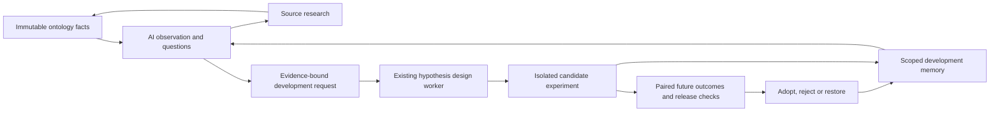

# Central AI control

`modules/ai_orchestration` owns independent observation, research scheduling,
execution accounting, bounded recall and recurring work. It is the thirteenth
business module. Domain-specific prompts and validators remain in their owning
contexts; runtime composition injects their capabilities into the controller.

## Running behavior

The managed `ai-control watch` worker discovers live portfolio/watchlist subjects
from persisted monitoring snapshots. It seeds one durable observation chain per
account and symbol. A matching RuleBox rule or a decision candidate is **not** a
prerequisite. Each observation reads bounded facts from the portfolio ABox and
its shared premise ABox, recording both snapshot identities and source clocks.
The versioned [observation evidence protocol](observation-evidence-protocol.md)
owns subject/linked/shared discovery, category budgets and explicit coverage.
Changing graph generations, missing facts and ownership mismatches defer work.

The model first chooses internal reads over a captured inventory, as described
below. An observation compares selected facts with up to three prior analyses (including
their dated numeric facts) and three research results. It produces an explicitly
unverified hypothesis, counter-evidence, comparison, up to two research questions
and a next-check interval of 60–1440 minutes. Identical monitored inputs and
research memory skip the model for up to six hours, with another check in three
hours. The fingerprint covers supplied business fields by default, including
nested source revisions, quality and eligibility. Only declared polling/storage
metadata is ignored. Excluded and unsupported facts retain an inventory digest.

## Internal retrieval and committed-data wakeups

The same managed worker now runs a bounded **read → inspect → read again →
conclude/defer** loop. No MCP server, additional daemon or message broker is added.
`StructuredObservationModel` is the model adapter; composition injects the current
Codex process runner. The application supplies the read capabilities and owns
iteration limits, while existing evidence and publication owners retain validation.

Before any model call, reasoning captures the subject's active portfolio and
shared-premise inventory in a short read transaction, then closes that transaction.
The initial routing prompt contains the required quote, coverage/catalog,
successful-delivery baseline, due-question summaries and memory counts. It does
not contain all financial/news bodies or all previous analyses. The model chooses:

| Internal function | Scope |
| --- | --- |
| `query_facts` | One evidence category, optional kind, server-issued cursor |
| `read_fact` | A known fact ID within that same captured subject/category |
| `recall_memory` | Bounded recent analyses or research/question/service memory |

These functions read the immutable in-memory capture, not an unrestricted SQL,
TypeQL or URL supplied by the model. The source inventory includes facts omitted
by the earlier automatic category budgets. Each read returns whole facts, source
snapshot identities, pagination and explicit byte exclusions. Historical memory
cannot become current investment evidence. Due questions remain mandatory final
context even if the model does not request optional memory. This does not add
arbitrary-depth graph traversal, unverified external web evidence or semantic
search over the full lifetime history.

There are at most three routing calls, two internal reads per routing call and
four records per page. Page size and offsets belong to the server. The v2 model
schema and validator share the same tool-specific field definitions; numeric
offsets/limits and unused fields are not accepted. A cursor must have been issued
by the same captured session for the same tool/category/kind. Fact responses allow 32 KiB and all admitted read results
share 40 KiB. The configured prompt budget and the 96,000-byte evidence-packet
limit still apply. Failed/oversized reads and missing coverage are explicit;
repeated identical reads stop the loop. The final author sees selected facts plus
the required quote, selected memory, due cases and a compact read audit. Reaching
the round limit retains its partial coverage; explicit deferral, repeated reads
and context failure block publication and agenda closure. Existing numeric checks,
independent review, delivery limits and research-only authority remain in force.

Every routing prompt is frozen in `ai_control_inputs` before its model call,
using the same lease and call-budget accounting as final author/reviewer calls.
The final generation v10 / repair v6 artifact also preserves the complete read
trace, whose hash is bound to the compact audit in the evidence packet. Historical
v9 / repair v5 and retrieval v1 prompts/traces remain exactly replayable. The owner page shows what was
queried, why, and the remaining coverage. Extra routing calls increase latency and
call usage; the daily quota still includes each of them.
Routing reserves the remaining author/reviewer capacity: with only those calls
left, it records `budget-fallback` and uses the existing automatic bounded packet.
Small configured quotas therefore do not repeatedly spend every call on retrieval
without ever reaching a final observation. The per-call hard gate remains final
authority if another worker consumes quota concurrently.

An invalid request gets at most one local correction within those same three
routing calls and the shared daily quota. The entire batch is checked before any
read; earlier admitted evidence is retained. Each response and its validation
errors/results are saved in `ai_control_retrieval_rounds` against the exact frozen
input, task attempt and live lease before proceeding. The local audit keeps up to
32 KiB of response JSON text, otherwise its byte count/hash and explicit omission;
it is immutable and expires with its parent input. The owner UI shows error fields
and correction attempts without exposing raw responses.

If correction fails or no routing call remains, the task records a terminal
`ai-retrieval-invalid-request` failure without authoring or publishing a judgment.
Its normal delayed recovery successor remains available. This is distinct from
`deferred` (insufficient evidence), `context-budget`, and operational failures
such as provider timeouts, which retain their existing bounded retry behavior.
Execution success and accepted explanation quality remain separate measures;
successful retrieval is not proof that an investment hypothesis is correct.

The production V2 worker publishes `ontology.observation_evidence_ready` in the
same lease-fenced transaction as job completion and market-source receipts. The
current delivery deployment is locked and checked again at that boundary, so a
shadow or retired deployment cannot wake live observations. Native completion,
aligned ABox identity and per-account evaluated symbols are required even when
no rule matched and no alert was emitted. The compact result preserves the
portfolio world from `ontologyWorld` as well as direct world metadata.

The legacy `ontology.reasoning_completed` event also carries the explicit world.
A transactional consumer of both events admits only matching active subjects
with a completed native inference run, aligned ABox identity and explicit target
symbols; an empty rule result is allowed. Collection alone, another world and
uncommitted/unaligned results cannot wake this path. `ai_control_evidence_events`
stores per-event receipts, so late event commits are not lost behind a timestamp
cursor. `ai_control_evidence_wakes` coalesces new snapshot identities per
account/symbol/world. Receipt, mailbox and scheduled task timing commit together.

Pending, never-attempted observations can move forward, with a minimum fifteen
minutes after the last completed observation for this event-driven wake. An
already-earlier scheduled check remains earlier. Processing work and retry backoff
are untouched; their mailbox remains pending until a successor can accept it.
Restarts resume the durable mailbox. Unchanged snapshots do not create repeated
wakes, and material fingerprints still suppress unnecessary model calls. Normal
periodic observation remains the fallback for old events without world metadata,
shared-premise-only changes and any projection path without this completion event.

`test_ai_directed_retrieval.py`, `test_ai_retrieval_recovery.py`, and `test_ai_evidence_wake.py` cover excluded-fact
retrieval, scope, immutable capture, repeated/oversized reads, lease loss, exact
legacy replay, late event commits, coalescing, retry preservation, live V2 routing,
deployment/attempt fences and atomic completion/event/receipt rollback.

Questions explicitly select an allowed capability. Future price/order-flow
checks remain observations and wait for the existing collectors; they do not
launch unrelated news searches. Documentary research questions call the existing research orchestration service, retaining
source verification, durable ResearchRun records, and source-change events into
graph projection. AI-generated account IDs, commands, URLs, trading actions or
unregistered capabilities are rejected. Hypothesis development requests now enter
the existing governed experiment lifecycle described below; the central AI does
not acquire rule or model promotion authority. The owner-requested central AI cutover retires the former
rule-triggered AI review and AI-authored `investmentInsight` route. The 2026-10-02
correction restores deterministic TypeDB relation observations as an independent
`PUBLISH_TYPEDB` path. Graph collection, RuleBox inference and internal case history
continue as evidence; they cannot trigger the former customer AI queue.

## AI and ontology development

The ontology is the shared model of facts, meanings and evidence. Central AI
compares explanations, identifies missing knowledge and chooses the next bounded
research task. TypeDB owns semantic rules and action envelopes; the existing
evolution control plane owns empirical admission, deployment and rollback.

`develop-hypothesis` is a third planner capability, limited to one question in
the existing two-question budget. It is intended for a concrete explanatory gap
or contradiction, including the observed follow-up of a previous explanation.
Missing documents remain source research, and future prices remain observation.
AI chooses whether a development question is warranted; a condition transition
alone does not automatically create a new rule or count as predictive success.

The observation must pass its local evidence checks; a rejected draft cannot
create development work. Customer delivery is independent: a valid internal
observation with `send=false` can request an experiment. Completion verifies the
exact persisted generation/correction input and completed model call, then saves
the request and observation in one lease-fenced MySQL transaction. Delivery
outbox and successor failures roll back that handoff as well.

The versioned `observation-development-v1` request preserves the complete bounded
evidence packet, source snapshots, selected evidence IDs, question, tentative
explanation, follow-up results and execution-input identity. It never fabricates
a matched rule, inference generation or DecisionEpisode. The existing
`investment_hypothesis_proposal_requests` queue consumes it, verifies its content
and subject, and passes proposed hypotheses to `HypothesisDevelopmentService`.
Only usable captured evidence can support a proposal. The initial explanation
and observed condition transitions remain explicitly empirically unverified.

At most one request per account/symbol/UTC capture date is admitted. Same-day
rewordings coalesce onto the first immutable request without resetting its
attempts or replacing evidence, including while it is pending or failed. The
existing proposal/development workers retain their workload accounting, capacity
limits and bounded authoring policy; they do not use the independent-observation
call quota. No worker or external scheduler is added.

Before the next observation, up to three scoped development records are read
alongside source-research memory. Linked cases are read at their current state,
including validation blockers and adoption/rollback. Changes participate in the
observation input identity and the exact selected memory is frozen before a
model call. This is experiment-status memory, not fresh investment evidence or
proof that a model improved. Missing case records stay unavailable. The owner
page shows the current progress separately from the original handoff receipt.

The executable improvement scope remains the one in
[ontology evolution](ontology-evolution.md): new conditional hypotheses using
registered models and existing ontology vocabulary, isolated trials, empirical
comparison, governed adoption and post-adoption recovery. New collectors, new
TBox types, model implementations and service-code changes require development.
This loop does not train the underlying LLM weights or let it rewrite its own
validation criteria. Actual improvement still requires future observations.

Generation v6 and correction v2 introduced the capability. Historical inputs
retain their original prompts and schemas. Tests in
`test_ai_ontology_development.py` cover the existing worker handoff, immutable
evidence, scope isolation, historical input compatibility, feedback memory,
daily coalescing and transactional failure/lease-loss behavior.

## Persistent questions and service feedback

The existing observation worker now owns a durable agenda in `ai_brain_cases`
and an append-only assessment history in `ai_brain_case_events`. These are
operational work records owned by `ai_orchestration`, not market ABox facts,
investment decisions or proof that the underlying model learned. The central
worker coordinates this memory; existing research and hypothesis-development
modules still own their execution and validation. No additional model service,
daemon or MCP server is needed for this loop.

Each question preserves its original explanation, counter-evidence, captured
fact values and source snapshots, exact model-input identity, completion
criterion, follow-up date and linked work. Observations review questions against
current captured facts and append an assessment with its own input and evidence
IDs. The original evidence is not replaced by a later interpretation. Historical
explanations are work memory and cannot substitute for fresh source evidence.

At most five active questions, ordered by due date, enter each scoped observation,
alongside up to three service proposals and the existing research/development
memory. Due questions are mandatory context: optional recent analyses and
research are trimmed first, including in correction prompts. If the required
packet does not fit, execution fails visibly without silently forgetting due
questions. Questions from another account, symbol or strategy world cannot be
reviewed. Completed questions remain in the ledger; this first iteration does
not implement semantic search over all past closed questions.

Each due case requires a reasoned `caseReviews` entry: wait, source research,
answered, blocked or dismissed. An answer needs usable current evidence but
remains an AI assessment, not independent proof of the answer's meaning. A
rejected observation cannot close a question. Research completion or failure
marks the original question for reassessment and wakes an unstarted observation;
it does not mean the question was answered. Due dates can also wake observations
without a user prompt or a market-data change. Existing budgets, pause controls
and lease fencing still apply. Wake-ups preserve failed-task retry intervals;
terminal observation failure defers due cases to the same recovery window as its
successor task (30 minutes for input capture failures, otherwise six hours).

Work is bounded to twelve active questions per account/symbol/world, three
research tasks per question and at least six hours between new research tasks.
Pending research and unchanged input suppress another task. Each task retains
the existing bounded failure retries. Exact questions coalesce after whitespace
and case normalization; this is not semantic deduplication of paraphrases.
Saturated cases remain visible as blocked/deferred instead of gaining unlimited
execution authority. Question state, research successors, model-development
handoff and notification outbox commit together under the task lease.

`serviceFeedback` allows at most one evidence-bound proposal per observation,
covering analysis, data, experience or operations. It records the observed
limitation, proposed change and a checkable success criterion. Inputs currently
focus on captured domain evidence, not arbitrary UI sessions or full production
telemetry, so the model may not claim to have observed screen failures or user
complaints absent from its input. There is at most one open proposal per subject
and category; daily coalescing preserves the original evidence. Proposals can be
retained from rejected observations, but are always explicitly unverified.

The owner can record planned, implemented or dismissed with a reason using
`PUT /api/ai-control/feedback`. Scope and captured revision must match. Owner
reports return in subsequent observation memory; an implementation report is
not an automated deployment or an empirical success measurement. The owner page
shows original evidence and recent case history. This workflow does not modify
service code, install collectors, rewrite goals or bypass the governed ontology
adoption process. Measuring whether a service change helped still requires
actual before/after outcomes.

Generation v7 and correction v3 add the agenda contract while retaining exact
historical v3–v6 and correction v1–v2 replay. `test_ai_brain_agenda.py` covers
due-memory capture, scope, owner permissions, lease loss, rollback, research
feedback, failure backoff and immutable origin evidence. Browser coverage also
checks proposal review and draft preservation on mobile and desktop.

## Independent observation notifications

The planner must explicitly return `notification: {send: boolean, reason: string}`.
It sees the last **successfully delivered** observation, including its dated facts,
as well as prior internal analyses. It should notify only for a useful new
interpretation: a hypothesis-changing trend, conflicting signals or important
new evidence. Price changes, polling timestamps or repeated missing data alone
are insufficient. There is no rule-match trigger. A second call critiques admitted
drafts against their exact evidence; it does not rewrite the customer message.

An actionless `aiObservation` outbox entry is committed in the same transaction as
the lease-fenced observation and successors. Unknown evidence IDs, trading
directives, ungrounded numbers and oversized narrative blocks cannot be published.
Facts come from the immutable ABox packet; text generation is not a source of
prices. The message shows price, change, holding cost/P&L when held, available
moving averages/volume/flows, price clock, novelty, comparison, hypothesis,
counter-evidence and next questions. Missing metrics are omitted. Financial
claims still require their source verification; this route grants no trading
authority and never manufactures a `DecisionEpisode`.

Before transport, an account lock covers durable task/job ownership verification,
active subject membership, exact rendered-content verification, repeat checks and
recording the transport receipt. Quotes must have a known source time no more than
24 hours old; captured analysis input must be no more than 30 minutes old. The
message labels the price's own time, not the send time. A pending alert that ages
out remains in history and the normal next observation reconsiders the subject.

Frequency policy: **180 minutes per account/symbol, at most two per symbol and
eight per account per UTC day**. A newly verified false-to-true transition of a
previously delivered `invalidates` condition may use a 60-minute interval. Daily
limits still apply. A price movement or model-authored urgency cannot waive them. Only successful delivery receipts
consume these limits and become the next comparison baseline. Identical input
fingerprints, an advanced comparison baseline, replay of delivered jobs and
retired subjects are suppressed. Policy/validation silence remains visible on
the central AI page. Partial transport retries preserve the exact text and clock;
as with existing delivery, a provider success followed by a process crash before
receipt persistence cannot promise exactly-once external delivery.

Runtime settings pin `investmentNotificationRoute=ai-control`; the old worker
count cannot revive it. New legacy queue admissions, claims, completions, direct
notification admission and final sends are blocked. The central worker retires
pending/in-flight legacy requests as superseded and old pending notifications as
suppressed, retaining their history and reason. A deterministic TypeDB observation
is exempt only when its graph observation contract, `NO_ACTION`, writer provenance,
dispatch route, account, symbol, subject case, generation and ABox identities agree.
The same predicate applies at queue admission, worker processing, legacy retirement
and final transport. Writer flags alone cannot reopen the old AI route. Production
dispatch converts graph-verified handoff candidates to direct TypeDB observations
without enqueueing AI; unchanged relationships remain archived. TypeDB delivery
does not advance central AI receipts, memory or cooldowns. Historical component tests can
still exercise old contracts using an explicit non-runtime settings fixture;
there is no production UI switch back to that route.

## Capture recovery and diagnostic reproducibility

Observation input-read failures (`evidence-read:*`) and a changed capture
generation retry after 30 seconds, then 120 seconds. The third failure terminates
that task and schedules its idempotent observation successor after 30 minutes.
These errors precede the model call. Model failures and ownership/validation
errors retain the general 30/60-minute retries and six-hour recovery window.
Lease fencing, three-attempt limits, immutable input attempt IDs and separate
budget deferrals apply to both policies. This is bounded recovery, not an inline
loop repeatedly running an expensive read or model.

Operations diagnostic section order is canonical, including after MySQL JSON
normalization. Equal frozen values reproduce identical text for the exact-body
delivery guard; modified drafts or messages remain blocked. Existing suppressed
history is not rewritten or resent automatically.

## Execution and limits

Observation, repair and independent review prompts default to **256 KiB of UTF-8
text**. Set `aiObservationPromptMaxBytes` or `AI_OBSERVATION_PROMPT_MAX_BYTES` to
override this operational limit (64–512 KiB). It is a byte budget, not the model's
token context window. Current evidence and the delivered comparison baseline are
preserved intact, together with due case memory. Optional prior analyses (64 KiB)
and research memory (48 KiB, including the space already used by due cases) are admitted
as whole records in recency order, subject to the total budget. Due cases may
exceed the research allowance but must still fit the total budget. Oversized optional
records are skipped with hashes and exclusion reasons in the frozen input.
Repairs can drop optional memory to fit the rejected draft and feedback; an
oversized required packet fails explicitly instead of silently losing facts.
The producing evidence contract retains its own category and 96,000-byte packet
limits; increasing the prompt budget does not override evidence admission.

Source-clock prompts (author v8, repair v4, review v2) distinguish immutable
source quality from elapsed time at capture. The evidence owner supplies a
versioned `quoteAssessment`; fresh capture/fetch clocks cannot renew old quotes.
Publication renders source age again at its fixed rendering clock and preserves
both capture and pre-send assessments in the successful receipt. Age is advisory:
dated and last-close analysis remains possible under the existing publication
policy, with explicit source-time wording. No new intraday TTL or market-hours
delivery gate is introduced. Prior prompt and review versions remain replayable.
See `docs/observation-evidence-protocol.md` for clock integrity and failure-stage
diagnostics. A successful replay is not evidence of a new model call or delivery.

Clock citation prompts (author v9, repair v5, review v3) give `counterEvidence`
an explicit `period=assessment` reference. `factId` still names the captured
stock; the allowed scalar fields resolve to its `quoteAssessment` entry and
the shared `checkedAt`. Every resolution recomputes the assessment from frozen
facts and capture time. Changed assessments, missing clocks and other fact IDs
cannot manufacture evidence. These references cannot support a market
hypothesis, numerical market comparison or follow-up condition. The reviewer
also recognizes sourceAsOf/maxAgeMinutes citations for a matching clock-only
limitation instead of requiring fields absent from facts. Independent review
and receipt admission stay mandatory; old prompts and schemas replay byte for
byte, and rejected historical results are never rewritten or automatically sent.

Independent observation calls first persist their exact input, selected memories
and prompt locally, including failed attempts; calls require a matching task and
prompt hash. Existing domain workloads retain their own audit contracts.
All existing background Codex adapters, investment judgement and interactive
chat enter the central execution ledger. The ledger records workload, prompt
hash, start/completion state and a safe error category, never the prompt or raw
provider errors. Existing capacity reservations and domain-specific validation
remain in effect. News, disclosure and model-review queues retain their own jobs. The former
rule-triggered investment AI workers are retired.

Background process calls also persist safe timing metadata in
`ai_control_call_metrics`: capacity wait, model process lifetime (including
termination cleanup), total execution time, configured timeout, UTF-8 prompt size,
return code and termination reason. These distinguish capacity contention from a
process timeout without storing raw process errors. Historical calls do not have
these timings. Rendering observation citations sorts section keys so equivalent
JSON objects produce the same message after database round trips.

Independent work defaults to **48 task starts and 24 model calls per UTC day**.
The owner can set `aiControlBudgetEnabled=false` to remove both daily limits.
Usage accounting, duplicate-input suppression, leases, process concurrency and
notification quality/frequency policies still apply. Numeric limits remain saved
for re-enabling; zero keeps its existing meaning of no capacity when limits are
enabled. Unlimited operation does not erase consumed calls or task history.
Retries that execute work consume budget too. Admission checks both budgets
before claiming a task; a new observation needs room for generation and an
independent critique. Exhaustion is `budget-wait`, not an idle worker or a
failed analysis. It preserves the pending job without using task attempts.
A call-budget race during execution defers the same leased task until the next
UTC day and does not consume its failure allowance; a raised limit lets that
task resume earlier. Counters and frozen input history are never reset to
manufacture capacity. The owner page shows the independent call counter,
remaining capacity, limit wait and next reset separately from other AI workloads.
Tasks use MySQL leases, heartbeat renewal, fenced
completion, stable root identities and transactional successor creation. A
completed ResearchRun is reused after retry. Source-provider work is at-least-once
when a process dies before its result is saved; this is not exactly-once external
execution. Three failed attempts terminate the task; failed observations start a
new recovery check six hours later. Removed subjects are retired when claimed.
Older in-progress process audit rows may remain `running` after an abrupt kill;
they must not be interpreted as proof the process still exists.

`aiControlEnabled=false` pauses central tasks and suppresses pending central
notification delivery; in-flight analyses may finish and remain in history.
`notificationAiQueueWorkerCount` no longer controls central AI. The managed central
worker has its own enable switch and reloads settings before each tick. News,
disclosure and other domain AI features retain their own admission budgets.
Priority is research follow-up before new observations, then oldest due work.

## Operator surfaces

An explicit send candidate that fails final publication validation now creates
one `aiObservationDiagnostic` operations notification in the same transaction as
the completed observation. It shows the rejected prose, validator/reviewer
reasons, correction status and the original captured quote. The prominent
`검증 미통과 초안` label also makes possible validator false positives visible;
it does not claim every rejected sentence is false. Ordinary `send=false`
observations remain silent, and an accepted corrected draft follows the normal
observation route. Parse/provider failures without a completed usable draft stay
in the task error ledger; this is not a fallback that invents an AI message.

Diagnostics use the configured operations/global-owner destination, never the
observed account's notification destination. They bypass account quiet hours and
investor cooldowns/quotas; the stable task-based outbox key and successful receipt
prevent duplicate sends. They do not update the investment delivery baseline,
follow-up conditions, decision outcomes or notification quota. The final transport
guard compares the exact diagnostic body with the completed task. An unavailable
operations transport remains a visible delivery failure, without account fallback.

- `/ai-control.html`: owner-only data, recent analyses, dated facts, schedules,
  process counts, enable switch and daily limits; linked from Operations.
- `GET /api/ai-control/status`: bounded owner-only task and call summary.
- `PUT /api/ai-control/settings`: writable-owner settings, validated limits.
- `PUT /api/ai-control/feedback`: writable-owner service-proposal review with revision checks.
- `python3 python_service/service.py ai-control status|once|watch`.

Tests in `test_ai_control.py` cover untrusted plans, independent operation,
account retirement, pause, lease loss, audit redaction, durable deduplication,
atomic successor creation, rollback and call/task budget enforcement. Existing
AI model, module-boundary and runtime-composition tests cover compatibility.

`test_ai_control_publication.py` verifies retirement, manual/replay blocks, stale
quotes, numeric/actionless validation, account isolation, cooldown boundaries,
atomic outbox rollback, successful-receipt memory and end-to-end worker delivery
without invoking the legacy reviewer.

## Evidence-bound customer explanations

`observation-insight-v1` requires a current/baseline fact ID and exact field path
for each of six explanation sections, observed numeric comparisons and one to
three executable follow-up conditions. Free prose cannot supply quantities;
values, labels, units and clocks are rendered from frozen facts. Small nonzero
ratios display as less than 0.01 instead of zero. Missing zero/default changes
are omitted when the quote is partial. The source is the provider, not the
holding/watchlist role. Daily-volume ratios are explicitly not same-time-of-day
comparisons.

The output JSON schema is generated from captured fact IDs and scalar paths and
persisted alongside the exact prompt. Model generation uses this schema; local
validation still checks field ownership, time, comparison truth/units, unsupported
flows, reference-only evidence and selected unsupported causal/certainty language.
Generation v4 binds each reference to its actual fact, field and period. Reference
facts are available only to the limitation section; numeric comparisons exclude
monetary facts without a recorded currency. Historical generation v3 inputs retain
their original prompt/schema validation and are never rewritten for this upgrade.
Period shorthand such as `5·20·60일선`, explicit negated certainty and statements
about limited data reliability do not by themselves assert a quantity or a price
cause. Unsupported quantities, asserted causes and investment directives still fail.
The draft's natural-language meaning is then independently critiqued with
`observation-review-v1`. Every section must be supported; generic or repeated
explanations remain internal. This critique is another AI assessment, not proof
of every possible semantic claim or commercial usefulness.

Generation, correction and review consume the existing central call budget. Only an
explicit send candidate that passes local checks receives a critique. Each review
has a frozen draft/input/schema, persisted execution record and completed model
call. Admission and final transport recheck that proof and the draft hash. Legacy
observations without this contract cannot pass the new final gate. Successful
receipts preserve the cited fields, explanation fingerprint and registered
conditions. Exact price jitter with the same cited relationships does not create
a new explanation; the reviewer also compares meaning with the last receipt.

If a send candidate fails deterministic validation, or independent review finds
grounding errors in an otherwise useful new explanation, it gets at most one correction
on the same frozen facts. The original draft, validation errors, comparison
diagnostics, any independent critique and parent input ID are persisted before that call. The correction may
choose silence and still needs full validation and independent review before
publication. Repetition and generic content do not trigger review-driven correction.
A failed correction never grants delivery permission. Rejected work
and results from an older generation prompt cannot activate the six-hour unchanged
input shortcut; only validated observations or accepted drafts from the current
prompt may reuse an unchanged input. No historical failed alert is auto-delivered.

Legacy receipt summaries omitted some quote fields, including currency and the
five-day average. For a new observation only, memory may recover those fields from
the original completed delivery task's frozen stock facts. Account, subject, task,
receipt job, input fingerprint, source/capture clocks and every retained scalar
must agree. Missing originals or mismatches remain incomplete. Added fields carry
explicit original-input provenance; neither receipt rows nor historical execution
inputs are rewritten, and current market data is never used for this recovery.

Follow-up evaluation belongs to `outcomes`. It compares the next collected stock
values with the two registered fields, using source clocks and a fixed horizon.
An already-true condition must become false before a new true transition counts.
Unchanged clocks, unavailable data and expired windows cannot become a success or
failure. Conditions support/weakening/invalidation describe an observation
contract, not calibrated prediction performance, and do not create investment
DecisionEpisodes. Checks run at scheduled observations, not on every market tick.
The next delivered explanation supersedes the prior receipt's active conditions.
Skipped model calls still persist condition state. Source currency changes and
unusable observations cannot trigger a check; cross-period comparisons require
chronological source timestamps.

The owner page shows rejection reasons, sentence references, condition results and
the actual transported text from the receipt (not a freshly rendered replacement).
Its review counts are operational quality diagnostics, not paid-service or return
qualification. User usefulness and willingness to pay still require a pilot.

Verification:

- `test_ai_insight_quality.py`: wrong price/cost and return/weight claims, unsupported
  causes and moving-average slopes, timestamps, units, critique tampering, semantic
  repetition, durable follow-up state and review failure.
- `test_ai_control_publication.py`: actual isolated MySQL review proof, atomic
  outbox, delivery receipt and retirement boundaries.
- `node scripts/test-ai-control-browser.cjs`: desktop/mobile receipt display,
  rejected explanations, expired checks, escaping and layout.
- `python3 scripts/replay-ai-observation.py /private/capture.json --output /private/output`:
  real model generation/critique from preserved historical facts, with zero queue
  writes or transport calls. Historical evidence is never enriched with later
  facts. It writes private local inputs, outputs and rendered messages. Central
  execution audit rows are recorded for model calls. Passing this replay is not
  a live delivery receipt.
