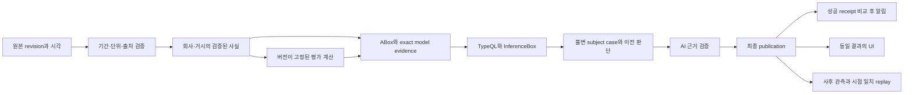

# 정확성 우선 투자 비서: 개발 위임 명세

- 작성일: 2026-09-25, Asia/Seoul
- 코드 조사 기준: `e1869648ac473585ef722e5bea185e2da3769fbc` (`main`)
- 상태: **IN-00~16 구현 완료, 운영 실증 대기**. 계산·검증·표시·격리 배포 계약까지 구현했으며, 데이터가 부족한 모델은 reference/shadow에 남는다. 개발 완료는 투자 모델 승격을 뜻하지 않는다.
- 사용법: 담당 모델은 [17개 작업 명세](#6-작업-명세)의 티켓 중 지정받은 범위만 수행한다. 최초 착수 지시는 [위임 프롬프트](#10-다른-모델에-전달할-프롬프트)를 사용한다.

## 실행 현황

- IN-00: [기준선·데이터 준비도 보고서](investment-assistant-in00-baseline.md)에 2026-09-25 읽기 전용 감사 결과를 기록했다. PLTR/NVDA는 검증 후보이며 현재 valuation decision에는 둘 다 부적격이다.
- IN-01: report contract가 없는 재무 기간을 현재 사실, ABox, AI 근거에서 제외하는 `financial-period-selection-v1`을 구현했다. 운영 cache 적용은 IN-02 범위로 남긴다.
- IN-02: 종목·source revision·cache fingerprint를 고정하는 preview manifest,
  최신 표지만 있고 출처 계약이 없는 입력 검출, confirmed/unknown 영향 분리,
  queue owner 기반 차단, 현재 cache 정정과 bounded reasoning 재평가를 구현하고
  PLTR·NVDA 운영 적용 및 재실행 0건 검증을 완료했다.
- IN-03: source/case machine timestamp를 기준으로 이전 판단을 연결하고, legacy KST 호환 파싱,
  cutoff 이전 indexed 조회, clock/조회 실패 진단, 최종 prompt의 이전 판단 ID·시각 보존을 구현했다.
  운영 이력 migration이나 release 승격은 수행하지 않았다. 상세 결과는
  [IN-03 판단 연속성 보고서](investment-assistant-in03-continuity.md)에 기록했다.
- IN-04: AI 작업의 의미 지문을 회사 재무 revision·평가 입력·가정·무효화 조건까지 확장하고,
  성공 transport receipt 재확인과 종목별 발송 잠금의 20회 반복/2-worker 경계를 검증했다.
  AI 사용량 한도·timeout·응답 형식·계약·일반 실행 실패도 별도 진단한다. 상세 결과는
  [IN-04 의미 변화와 전달 보고서](investment-assistant-in04-semantic-delivery.md)에 기록했다.
- IN-05: 컨센서스 정규화 v2로 horizon·범위·표본·revision 시계를 분리하고,
  analyst/fundamental 병합 순서와 무관한 필드 소유권, exact source revision 연결,
  음수·0·FY2 관측 보존 및 양수 PER 적격성 분리를 구현했다. 상세 결과는
  [IN-05 컨센서스 보존 보고서](investment-assistant-in05-consensus.md)에 기록했다.
- IN-06: reported basic/diluted EPS와 same-report 재구성 EPS를 분리하고,
  현재 발행주식 수 fallback을 reference-only로 낮췄다. 동일 기간·scope·보통주 귀속 범위·
  가중평균 주식 수·exact revision을 검증하며 ADR/환율 변환의 방향과 중복 적용도 차단한다.
  상세 결과는 [IN-06 EPS basis 보고서](investment-assistant-in06-eps-basis.md)에 기록했다.
- IN-07: peer와 historical 배수 분포를 분리하고, issuer/security·horizon·회계/EPS basis·
  가격/이익 기준 시각·upstream의 비교 가능성을 표본별 포함·제외 ledger로 검증한다.
  중복·충돌·stale·bootstrap-only 및 정상화 근거 없는 경기순환 입력은 판단용 평가에서 차단한다.
  상세 결과는 [IN-07 비교 배수 보고서](investment-assistant-in07-comparable-multiples.md)에 기록했다.
- IN-08: 원본 revision과 평가 시계를 고정한 `valuation-input-bundle-v1`, 결과 ID, audit/material fingerprint 및 이전 평가 delta를 구현했다. UI·ABox·AI 작업 지문이 같은 bundle/assessment를 사용한다.
- IN-09: 검증된 연간 재무에서 최대 3개 회사 driver를 만들고, 금리·환율은 명시적 기업 노출 revision이 있을 때만 연결한다. 현재 운영 데이터에 노출 정보가 없으면 unresolved로 남는다.
- IN-10: 사건 시각, 조정 가격 반응, 시장·업종 비교, 독립 출처와 대안 설명을 확인하는 인과 주장 계약을 구현했다. 원인 미확인은 고객 메시지 근거로 승격되지 않는다.
- IN-11~12: 순수 FCFF driver DCF와 동일 코어 기반 reverse DCF를 구현했다. NVDA 한 종목에는 시점 고정 재무·컨센서스·USD 금리 revision으로 shadow 입력 bundle을 공급하고 가정 검토 상태를 표시한다. 명시적 입력 bundle이 없는 종목에는 자동 적용하지 않으며, 검토 전 DCF가 근거 기반 PER를 밀어내거나 두 값을 평균내지 않는다.
- IN-13~14: 평가 snapshot을 그래프·reasoning facts·실제 AI prompt에 연결하고 기존 종목 평가 API와 화면에 새 사실, 이전 판단 차이, 인과 상태, 모델별 평가, 다음 확인 항목을 추가했다.
- IN-15: 후보 runtime 격리, 동일 frozen input 비교, 전달 capability 0, resource budget, rollback receipt를 fail-closed 계약으로 구현했다. 실제 운영 후보 승격은 수행하지 않았다.
- IN-16: 독립 episode 단위 품질 평가와 미래 정보·불완전 replay 제외 계약을 구현했다. 독립 미래 관측이 아직 없으므로 확대 자격은 미완료다.
- 상세 구현과 남은 데이터 제약은 [IN-08~16 통합 보고서](investment-assistant-in08-in16-integration.md)에 기록했다.

## 1. 제품 목표와 개발 원칙

사용자는 가격을 반복해서 설명하는 봇보다 **회사에 무슨 변화가 생겼고, 그 변화가 기업가치와 기존 투자 판단에 어떤 영향을 주는지 근거와 함께 알려주는 비서**를 원한다. 우선순위는 사용자가 명시한 “틀린 정보가 더 해롭다 — 정확성 우선”이다.

첫 제품 범위는 데이터가 준비된 **2개 종목**이다. 종목명은 IN-00의 준비도 조사로 결정한다. 이미 관심 종목이라는 이유만으로 계산에 필요한 데이터가 갖춰졌다고 간주하지 않는다. 2개를 확보하지 못하면 준비된 종목만 시범 적용하고, 나머지는 부족한 입력을 표시한다.

사용자에게 제공할 한 번의 분석은 다음 질문에 답해야 한다.

1. 이전에 전달한 판단 이후 어떤 사실이 바뀌었는가?
2. 무엇이 확인된 사실이고 무엇이 추정·가정·미확인 설명인가?
3. 매출, 이익률, 현금흐름, 자본비용 중 어느 경로에 영향을 주는가?
4. 동일한 방법과 가정에서 평가값이 어떻게 변했는가? 현재 가격과 비교하면 어떤 조건이 필요한가?
5. 기존 판단을 유지하거나 수정할 근거와 반증 조건은 무엇인가?
6. 다음에 확인할 사건·수치·시점은 무엇인가? 실제 추적이 등록됐는가?

### 1.1 반드시 지킬 경계

- 과거 실적의 기간·단위·출처 오류는 격리한다. `low confidence`를 붙여 계속 판단에 사용하지 않는다.
- 미래 성장률이나 할인율의 가정은 허용하되, 관측값과 분리하고 근거·버전·민감도를 공개한다. 정확한 계산과 미래 적정가의 정확성은 별개다.
- 결측, 0, 음수, 공급자 장애, 오래된 값, 충돌한 값은 다른 상태다. 결측을 0이나 현재 가격으로 채우지 않는다.
- 단일 가격보다 조건부 평가 범위를 제공한다. 시나리오 범위는 확률구간이 아니다. 근거 없는 범위를 만들지 않는다.
- “실적 발표와 주가 상승이 함께 관찰됐다”와 “실적 때문에 주가가 올랐다”를 구분한다. 설명하지 못한 가격 움직임은 미확인으로 남긴다.
- AI는 출처가 확인된 근거와 계산 결과를 해석한다. 재무 수치, 목표 배수, 인과관계, 허용되지 않은 매매 행동을 창작하지 않는다.
- 계산 가능, 데이터 적격, 모델 승인, 투자 행동 허용, 알림 전달을 별개로 검증한다. 계산 성공만으로 매수·매도를 허용하지 않는다.
- 과거 판단·원문·발송 본문은 보존한다. 오류는 정정 기록과 현재 파생 상태의 재구축으로 처리한다.

### 1.2 초기 범위에서 제외

전 종목 자동 DCF, 모든 산업에 공통인 적정 PER, 실시간 모든 뉴스의 완전한 인과 설명, 자동 주문, 자동 학습에 의한 규칙 변경, 데이터 구매·새 유료 API 가입, 새로운 브로커·마이크로서비스·월드별 워커는 포함하지 않는다. 필요한 데이터 계약이나 예산 결정은 부족한 항목과 영향을 기록하는 별도 결정으로 남긴다.

## 2. 현재 구현에서 확인한 것

아래는 기준 커밋의 코드와 **합성 입력을 사용하는 읽기 전용 함수 호출**로 확인했다. 운영 데이터가 지금도 같은 상태인지, 오류가 실제 고객 판단에 영향을 주었는지는 별도 조사 대상이다. 이전 대화의 실데이터 관찰을 현재 운영 상태의 확정 증거로 재사용하지 않는다.

| ID | 확인 내용 | 근거와 의미 | 담당 티켓 |
| --- | --- | --- | --- |
| F-01 | 기존 데이터 복구 기능이 이미 있다 | `financial_repair_plan`, `run_financial_evidence_maintenance`, `quarantine_financial_input` 및 `test_financial_evidence_repair.py`가 존재한다. 새 복구기를 중복 작성하지 않는다. | IN-01, 02 |
| F-02 | 더 최근 날짜의 미검증 연간 행이 병합 후 남는다 | `merge_company_knowledge_rows`에 미검증 `2026-06-30` annual과 검사 버전 표시(`financial-reporting-v2`)가 있는 `2025-12-31` annual을 넣으면 전자가 남는다. 날짜 우선 선택은 오분류된 행을 제거하지 못한다. 이 실험은 병합 동작의 재현이며 실제 재무값 검증이 아니다. 기존 복구기도 이 병합 함수를 사용한다. | IN-01 |
| F-03 | 표시 시각이 판단 연속성을 끊을 수 있다 | 동일한 합성 이전 판단에서 `2026-08-16T02:00:00Z`는 `available`, 같은 시각의 `2026-08-16 11:00 KST`는 `no-prior-decision`이었다. 호출부는 `referenceDate`를 전달하고 parser는 ISO 형식을 기대한다. | IN-03 |
| F-04 | EPS 관측 보존과 계산 적격성의 구분이 부족하다 | `collect_earnings_observations`는 합성 FY1 EPS -1 및 FY2 EPS 2를 모두 제거한다. FY1 EPS 2는 보존한다. `_positive`와 `ANNUAL_EPS_PERIODS`를 확인했다. 음수는 유효한 관측이며, FY2는 FY1과 다른 평가 시점이다. | IN-05, 06 |
| F-05 | 풍부한 컨센서스 정규화 기능은 이미 있다 | yfinance 정규화에 FY1/FY2, low/base/high, 분석가 수, 수정 정보가 있다. 값 소실은 수집·데이터셋 병합·모델 입력의 전체 경로에서 확인해야 한다. | IN-05 |
| F-06 | 성장·반도체 평가의 현재 핵심 산식은 EPS × PER다 | 두 모델은 `_fundamental_scenario_row`를 공유한다. 성장·이익률은 주로 근거 충족 판정에 사용되고, 범용 driver DCF 구현은 이 경로에 없다. | IN-07, 11 |
| F-07 | 표본이 부족하면 고정 배수 범위가 계산에 남는다 | `multiple_evidence_band`는 `bootstrap-prior`, `evidenceBacked=false`를 반환한다. 기존 적격성 게이트가 존재하므로 승인 우회나 무조건 숫자 삭제로 대체하지 않는다. 표시·AI·그래프의 이용 범위를 함께 검증한다. | IN-07, 13, 14 |
| F-08 | 연간 순이익/주식 수 대체 계산에 검증 공백이 있다 | annual 첫 행의 순이익을 해당 행 또는 현재 자본 정보의 `sharesOutstanding`으로 나눈다. 연간 기간·귀속 순이익·가중평균 주식 수가 일치한다는 증명과 별개다. | IN-06 |
| F-09 | 평가 서비스의 영향 범위가 넓다 | 동일 `ValuationModelService`를 종목 조회와 그래프 사실 생성이 사용한다. 알림만 차단하는 shadow는 공용 파서·캐시 변경의 격리를 보장하지 않는다. | IN-00, 08, 15 |
| F-10 | 재무 근거 보존·발송 영수증 기반 중복 방지 구현이 있다 | `financial-report-observation-v1`, 재무 audit/decision fingerprint, 압축 프롬프트 검증, receipt 경쟁 조건 테스트가 있다. 새 중복 체계를 만들기 전에 실제 사용 경로와 남은 우회 경로를 검증한다. | IN-04, 13 |

소스 진입점:

- [회사 상태 생성·병합](../python_service/digital_twin/modules/news_intelligence/domain/company_knowledge.py)
- [재무 복구 계획](../python_service/digital_twin/modules/news_intelligence/application/financial_evidence_repair_service.py), [운영 복구 어댑터](../python_service/digital_twin/infrastructure/financial_evidence_maintenance.py)
- [판단 이력 연결](../python_service/digital_twin/modules/decisions/application/notification_decision_memory.py), [연속성 조립](../python_service/digital_twin/modules/decisions/application/decision_continuity_service.py)
- [EPS·배수 근거](../python_service/digital_twin/modules/portfolio/domain/valuation/evidence.py), [모델 계산](../python_service/digital_twin/modules/portfolio/domain/valuation/models.py), [평가 서비스](../python_service/digital_twin/modules/portfolio/domain/valuation/service.py)
- [yfinance 정규화](../python_service/digital_twin/infrastructure/external_signal_provider_yfinance.py), [외부 데이터 병합](../python_service/digital_twin/modules/market_data/application/external_data/read_model_service.py)

착수 모델은 HEAD와 관련 테스트를 다시 확인한다. 이미 해결됐다면 재현·회귀검증 증거를 남기고 티켓을 종료한다. 현재 코드를 과거 상태로 되돌려 계획과 맞추지 않는다.

## 3. 모듈과 월드의 책임

[개발 방법론](development-methodology.md)과 [모듈 구조](module-architecture.md)가 이 문서보다 우선하는 저장소 계약이다. 구현 전에 두 문서와 루트 `AGENTS.md`를 읽는다. 아래 경로의 기준은 `python_service/digital_twin/modules/`다.

| 소유 모듈 | 구현 책임 | 경계 밖의 일 |
| --- | --- | --- |
| `market_data` | 공급자별 원본 revision, 관측 시각, 수집 상태, 정규화용 공개 입력, 금리·환율 시계열 | 회사 투자 판단, 목표 PER 결정 |
| `news_intelligence` | 보고 기간·회사 정체성 검증, 정정 관계, 회사 현재 상태, 사건·검증된 주장 | 원문에 없는 숫자 보충, 매매 행동 결정 |
| `portfolio/domain/valuation` | 순수 평가 계산, 가정과 입력 버전, 산식·민감도·입력 적격성 | DB/API 호출, 독립적인 BUY/SELL 판단 |
| `model_registry` | 평가·가설 릴리스, TBox/RuleBox 의미, 승인·실증 자격 정책 | 표본 수만으로 정확성을 보증 |
| `reasoning` | 영향을 받은 사실 조립, ABox, exact model evidence, native TypeQL, InferenceBox | Python의 별도 매매 규칙, 전체 월드 매번 재구축 |
| `decisions` | 불변 subject case, 이전 판단, AI 검증, 최종 publication | 발송 성공 추정, 실패를 HOLD로 기록 |
| `notifications` | 성공 receipt 기반 전달 여부, 본문 렌더링·전송·재시도 | 판단 근거나 적정가 재계산 |
| `outcomes` | 시점 일치 replay, 정정 영향 격리, 사후 관측·평가 | 미래 정보로 과거 판단 개선 |
| `read_models` | 같은 평가 결과의 UI 조회·근거 연결 | UI 전용 다른 평가값 생성 |

모듈 간에는 기존 `public.py` / `contracts.py`를 사용한다. 바로 필요한 읽기와 트랜잭션은 동기로 유지하고, 느린 수집·추론·AI·발송은 기존 durable queue/outbox를 사용한다. 기존 `external_data.fact_changed` 및 관련 이벤트를 확장할 수 있는지 먼저 검토한다. 단순 함수 결과마다 새 이벤트를 만들지 않는다.

### 3.1 회사·거시 월드의 구체화 범위

월드를 늘리는 대신 **판단에 필요한 사실의 정확도와 연결**을 높인다.

- 회사 사실: 실적 기간, 매출·이익·현금흐름·주식 수, 부채·현금, 선택된 사업 지표, 공시·정정 사건.
- 거시 사실: 정책금리와 시장금리를 구분한 시계열, 만기·통화·관측 시각, 환율 방향과 기준 통화.
- 연결: “해당 기업의 어떤 매출·비용·차입·할인율 가정에 이 사실이 연결되는가”를 출처 또는 명시적 시나리오 가정으로 표현한다.
- 계좌 사실: 기업의 영업 환노출과 계좌의 원화 환산손익을 분리한다. 공개 회사 사실에 계좌 정보가 섞이지 않게 한다.

실시간 경로는 기존 `incremental-current-state-one-pass-v1`을 유지한다. `SemanticChangeSet` → 영향 종목의 fact slice → 계좌 overlay → 한 번의 `PortfolioWorld` native generation이다. `SharedPremiseWorld`는 오프라인 정합성·마이그레이션 용도이며 실시간의 추가 선행 단계로 만들지 않는다.



## 4. 데이터 계약과 계산 규칙

이 절의 새 packet 이름·추가 필드·reason code는 **구현 목표**다. 이미 같은 의미의 계약이 있으면 그 계약을 호환 확장한다. 여기 적힌 이름이 현재 API에 존재한다고 가정하지 않는다. 변경 의미와 소유자를 먼저 정하고, 저장소의 버전·마이그레이션 규칙을 적용한다.

### 4.1 공통 관측 계약

기존 `financial-report-observation-v1`, `company-event-observation-v1`, 외부 데이터 lineage를 재사용한다.

| 필드군 | 필수 의미 |
| --- | --- |
| 정체성 | observation ID, 회사·증권 식별자, metric, provider, upstream origin, dataset ID, immutable revision ID, 원문 위치/URL |
| 값 | 원래 값과 단위, 정규화 값·통화·배율, instant/duration, 수치 변환식과 원래 필드명 |
| 보고 기간 | start/end, fiscal year, quarterly/YTD/annual/TTM, 연결/별도, 회계 기준, basic/diluted 및 reported/adjusted 구분 |
| 시계 | sourceAsOf, publishedAt/availableAt, fetchedAt/ingestedAt, derivedAt를 구분. 모르는 시각은 모른다고 기록 |
| 검증 | valid/missing/invalid/conflicted 등 기존 상태에 맞춘 typed 결과, 제외 이유, 필드별 검사 범위 |
| 정정 | 원 revision, superseding revision, 정정 사유와 발견 시각. 과거 입력을 덮어쓰지 않음 |

`financialIntegrity.status=checked`만으로 모든 필드가 검증됐다고 판단하지 않는다. 공급자·기간·metric별 검사 결과가 있어야 한다. SEC 회사 API는 표준 taxonomy와 기업 전체에 적용되는 facts를 중심으로 제공하므로, 사업부 KPI·가이던스까지 모두 존재한다고 가정하지 않는다. [SEC API 범위](https://www.sec.gov/search-filings/edgar-application-programming-interfaces)

시간 규칙:

- 저장·비교에는 timezone이 있는 ISO UTC, 사용자 표시에는 로컬 시각을 쓴다. 표시 문자열을 다시 계산 입력으로 사용하지 않는다.
- frozen case 입력 cutoff와 최종 판단의 `recordedAt`는 서로 다른 시계다. 과거 replay의 cutoff는 [기존 replay 계약](point-in-time-decision-replay.md)을 따른다.
- 당시에 수집되지 않았던 정정 공시나 컨센서스 revision을 과거 입력에 끼워 넣지 않는다. 공개돼 있었지만 로컬 수집이 늦었던 정보도 “시스템이 실제 알고 있던 정보” replay에 넣지 않는다.
- 날짜만 있는 공개 시각은 intraday 선후관계를 입증하지 못한다. 잘못된 cutoff는 `invalid-clock` 등 명시적 진단으로 처리하고 현재 시각으로 대체하지 않는다.

### 4.2 컨센서스와 EPS

`EarningsEstimateObservation` 확장 목표:

```text
observationId, symbol, provider, upstreamOrigin, sourceReferences[]
providerPeriod, horizon, targetPeriodStart, targetPeriodEnd
currency, perShareBasis, accountingBasis, estimateBasis
base, low?, high?, analystCount?, sampleState, rangeKind
sourceAsOf?, fetchedAt, revision30dPct?, revisionSourceReferences[]
validationState, excludedReasons[]
```

- FY1, FY2, TTM, 앞으로 12개월은 서로 다르다. FY2를 보존하되 FY1 평가에 자동 투입하지 않는다. 공급자별 FY1 정의와 실제 목표 회계연도를 보존한다.
- 원본 `forwardEPS`라는 이름만으로 NTM을 확정하지 않는다. 상위 정규화가 FY1에서 만든 scalar면 그 horizon을 유지한다.
- EPS -1과 0은 관측값으로 보존한다. 양수 EPS 기반 PER 모델의 입력으로는 부적격 처리할 수 있다.
- low/high가 없으면 없음으로 남긴다. 내부 legacy 응답이 세 값을 요구하면 별도 compatibility projection으로만 같은 점을 반복하고 `single-point`를 명시한다. 사용자에게 범위처럼 보여주지 않는다.
- 같은 upstream 컨센서스를 전달하는 두 API는 두 독립 표본이 아니다. provider 개수나 분석가 수를 정확도·확률로 번역하지 않는다.
- 보고 EPS를 우선한다. 재구성 시에는 해당 기간의 보통주 귀속 이익, 같은 기준의 가중평균 주식 수, basic/diluted 정의가 모두 필요하다. 현재 발행·유통 주식 수로 대체한 값은 보고 EPS가 아니다. [IAS 33](https://www.ifrs.org/issued-standards/list-of-standards/ias-33-earnings-per-share/)
- 분기 EPS × 4는 자동 연간화하지 않는다. TTM은 중복 없는 비교 가능한 기간으로 구성하고 분할·희석 기준을 확인한다. YTD 차감으로 분기를 만들 때에도 원 기간·범위·회계 기준을 검증한다.

### 4.3 평가 입력과 결과

`ValuationInputBundle`과 `ValuationAssessment`는 `portfolio`가 소유할 버전 계약의 작업명이다.

```text
ValuationInputBundle
  contractVersion, bundleId, subjectId, securityLine, valuationCurrency
  valuationAt, knowledgeCutoffAt, quoteObservationId
  sourceRevisionVector, normalizedObservations[], exclusions[]
  assumptions[] {id, value, unit, rationale, provenance, version, status}
  modelReleaseId, calculationVersion, normalizationVersion
  auditFingerprint, materialFingerprint

ValuationAssessment
  assessmentId, bundleId, modelId, modelVersion, assumptionVersion
  calculationStatus, inputEligibility, modelApprovalState
  valuationDecisionEligible, blockedReasons[], warnings[]
  scenarios[] {scenarioId, valuePerShare, currency, horizon, assumptionIds[]}
  inputEvidenceIds[], formulaTrace[], sensitivity[], comparisonModels[]
  valueChangeAttribution?, generatedAt
```

상태를 하나의 `confidence`로 합치지 않는다. 잘못된 입력은 `invalid`이고, 데이터는 맞지만 모델 적용이 부적절하면 `inapplicable`이며, 계산됐으나 승인되지 않았다면 reference-only다. 마지막 투자 행동 권한은 여전히 TypeDB의 action envelope다.

동일 bundle·모델·가정·기준 시각이면 동일한 계산 결과와 material fingerprint가 나와야 한다. 시스템 현재 시각에 의존하는 freshness 계산은 명시적 평가 시각을 받도록 호환 확장한다. 외부 API/DB를 순수 계산 함수 안에서 호출하지 않는다.

audit fingerprint에는 lineage 변경이 들어가고, material fingerprint에는 판단 의미를 바꾸는 값·기간·유효성·가정 변경이 들어간다. 단순 재수집이나 URL 추가는 재평가 감사 기록을 만들 수 있지만 새 투자 알림 사유는 아니다. 반대로 출처 충돌·정정으로 적격성이 바뀌면 값이 같아도 의미 있는 변화다.

합성 기준값: EPS `1.8 / 2.0 / 2.2`, 같은 horizon·basis의 PER `18 / 20 / 22`이면 결과는 `32.4 / 40.0 / 48.4`다. 이는 가정 조합의 시나리오이지 신뢰구간이 아니다. 가격 42와 기준값 40의 차이는 `gapToValuePct = (40 / 42 - 1) × 100`으로 산식을 명시한다. 다른 분모의 안전마진과 혼용하지 않는다.

### 4.4 사건·가치 변화·가격 설명

기존 회사 사건과 검증된 주장 계약을 확장해 다음을 연결한다.

```text
eventId / eventRevision -> verifiedClaimIds -> affectedDriverIds
  -> priorAssessmentId / currentAssessmentId -> hypothesisEvidenceIds
  -> sourceCaseId -> publicationId -> successfulReceiptId
```

- 사건 동일성은 제목·기사 URL 동일성이 아니다. 하나의 공시를 인용한 여러 기사를 여러 독립 사건으로 세지 않는다.
- `observed-event`, `supported-mechanism`, `causal-hypothesis`, `unresolved`처럼 주장 강도를 구조화한다. 실제 enum은 기존 claim 계약에 맞춘다.
- 가격 관측은 거래 세션·기업행동 조정·기준 가격·구간을 갖는다. 발표 후 움직임이라는 순서가 성립하는지 확인한다.
- 주가 변화와 평가값 변화는 별도다. 금리·이익 가정 변경이 계산상 가치를 움직였다는 설명이 실제 주가의 원인 증명이 되지 않는다.
- 가치 변화 분해는 입력 하나씩 고정한 재계산 또는 명시된 분해법을 쓴다. 상호작용/잔차를 남기고 각 기여도가 실제 전체 변화와 맞는지 검증한다. 미래 horizon 전환은 이익 전망 수정과 분리한다.

## 5. 순서와 배포 단위

| 구간 | 티켓 | 결과 | 다음 단계 통과 기준 |
| --- | --- | --- | --- |
| 기준선 | IN-00 | 데이터 준비도·재현 fixture·격리 범위 | 조사 증거와 2종목 후보/부족 입력이 기록됨 |
| 재무 신뢰 | IN-01, 02 | 잘못된 행 제외, 현재 상태 복구 절차 | 원본→현재 사실 일치, 역사 불변, 복구 재실행 안전 |
| 판단 연속성 | IN-03, 04 | 이전 판단 연결, 의미 기준 전달 | 중요한 변화 유지, 같은 근거 반복 억제 |
| 기본 평가 | IN-05~08 | 입력이 검증된 EPS×PER와 불변 결과 | horizon·basis·배수 출처·계산 재현 증명 |
| 회사·거시 설명 | IN-09, 10 | 사업 변수 연결과 절제된 사건 설명 | 수치·기제·추정·미확인 구분 |
| 전달 통합 | IN-13, 14, 15 | 그래프·AI·알림·UI 일치 및 제한 배포 | 같은 입력 비교, 무권한 전달 0, rollback 검증 |
| 평가 확장 | IN-11, 12 및 IN-13~15 확장 검증 | driver DCF·가격 역산 | 새 입력 준비도와 계산/해석 검증을 별도로 통과 |
| 사후 검증 | IN-16 | 예측·알림 품질 평가와 확대 결정 | 독립 관측, 대조군, 비용·누락을 포함한 평가 |

**첫 출시(R1)**는 IN-00~10, IN-13~15를 충족한 2종목의 근거 있는 기본 분석이다. DCF 데이터가 없다는 이유로 이 출시를 무기한 미루지 않는다. **두 번째 출시(R2)**에서 데이터가 준비된 1종목에 IN-11~12를 추가한다. IN-16의 관측 수집은 R1부터 시작하되, 통계적 유효성·수익 성과 판정은 필요한 시간이 지난 뒤 수행한다.

권장 단위는 티켓별 검증 가능한 커밋이다. IN-00 완료 전에는 여러 모델에 같은 공용 파일을 동시에 수정시키지 않는다. 이후 독립 작업을 나눌 때도 계약·schema·composition·release 파일의 소유자를 한 명으로 정한다. 이 문서는 병렬 작업 실행 자체를 요청하지 않는다.

의존성 요약:

```text
00 -> 01 -> 02
00 -> 03 -> 04
00 -> 05; 01 + 05 -> 06 -> 07 -> 08
01 + 05 -> 09 -> 10
02 + 04 + 08 + 10 -> 13 -> 14 -> 15 -> R1
08 + 09 -> 11 -> 12 -> 13/14/15의 확장 검증 -> R2
00에서 평가 기준 고정 -> R1부터 16 관측 -> 확대 또는 유지/격리
```

## 6. 작업 명세

아래 파일은 조사 시작점이다. 관련 경로를 추적한 뒤 최소 변경으로 구현한다. 신규 테스트 파일을 추가하면 `python_service/tests/suite_manifest.json`에 tier와 core 여부를 명시한다. 기존 테스트가 잘못된 의미를 고정했다면 변경 사유와 올바른 반례를 함께 남긴다.

### IN-00 — 기준선, 데이터 준비도, 재현 입력 고정

**선행:** 없음. **소유:** `outcomes`의 감사/replay 경계와 각 데이터 소유 모듈. **목표:** 추측으로 개발 대상을 정하지 않는다.

작업:

1. HEAD, 변경 파일, 관련 런타임 버전과 활성/후보 release 식별자를 기록한다. 설정 전체나 credential은 출력하지 않는다.
2. 기존 source revision, retained snapshot, company cache, 평가 입력, 실제 AI 실행 artifact, 성공 발송 receipt를 연결하는 읽기 전용 조사 경로를 정한다. 생성자가 DDL·retention·refresh를 수행하는 어댑터를 읽기 전용이라고 가정하지 않는다.
3. [데이터 준비도 표](#71-데이터-준비도)를 후보별로 채운다. 상태는 `미확인 / 없음 / 원본 있음 / 정규화됨 / 검증됨 / 해당 모델에 적격`으로 구분한다. 모델 승인 여부는 별도 열이다.
4. 동일 시간창의 기존 알림을 사건·의미 변화 기준으로 라벨링한다. AI 성공, 실행 실패, 계약 실패, suppression, 전달 성공을 따로 집계한다. 알림을 보내지 않았어야 할 경우뿐 아니라 보내야 했는데 빠진 경우를 표본에 넣는다.
5. F-02~04를 개인정보 없는 합성 fixture로 만든다. 틀린 동작을 정답으로 고정하는 테스트는 추가하지 않는다. 수정 티켓에서 원하는 동작의 회귀 테스트와 수정 코드를 함께 넣는다.
6. shadow의 쓰기 대상, 전달 capability, 캐시 namespace, queue, TypeDB DB, 공유 CPU/DB/AI 예산을 표로 만든다. 새 실험을 가동하지 않아도 식별 가능한 경계를 먼저 명세한다.

시작점: `outcomes`의 기존 replay 서비스, `reasoning/application/reasoning_shadow_service.py`, `reasoning/domain/reasoning_engine_versions.py`, `market_data/application/external_data/read_model_service.py`, `read_models/application/instrument_valuation_query_service.py`.

**완료 조건:** 각 후보의 필수 입력마다 상태·revision·부족 이유가 있고, 최초 대상 선정 이유가 재현 가능하다. 감사 실행 전후의 운영 쓰기·수집·발송이 0이며, 남은 미확인 상태를 수집 완료로 보고하지 않는다. 표본 기간·보존 범위·누락 기록을 명시한다.

**검증/산출물:** T1·T3의 기존 fixture 재사용 여부 확인, 비식별 준비도 보고서, 합성 재현 입력, 기준선 metric 정의, 보호할 비대상 종목 입력. 실제 계좌/메시지 artifact는 기존 로컬 보존소에만 남기며 git에 추가하지 않는다. 새 보관 위치를 쓰면 먼저 ignore 여부를 확인한다.

**변경 제한/복구:** 운영 데이터 수정, `maintenance --apply`, release 승격은 금지. 이 티켓은 조사·검증 기반 마련이다.

### IN-01 — 오분류·미검증 재무 행을 현재 사실에서 제외

**선행:** IN-00. **소유:** `news_intelligence`. **목표:** 최근 날짜라는 이유로 잘못된 반기/연간 자료가 현재 기업 상태를 차지하지 않게 한다.

시작점: `news_intelligence/domain/company_knowledge.py`의 `_sec_fact_periods`, `build_company_knowledge`, `merge_company_knowledge_rows`; `news_intelligence/domain/financial_reporting.py`; 기존 `financial-report-observation-v1`.

작업:

1. source → dataset payload → company cache → merge → 현재 재무 선택 → valuation/ABox의 선택 경로를 추적한다. 현재 SEC parser가 이미 기간을 구분한다는 사실과, 과거 잘못된 cache 행이 남는 문제를 분리한다.
2. 행이 속한 annual/quarterly/YTD 분류를 원 보고 기간·form·scope·metric duration으로 검증한다. instant 항목과 duration 항목을 같은 기간값으로 취급하지 않는다. 회계연도 말이 12월이 아닌 회사도 지원한다.
3. 기간 계약이 없는 legacy 행을 새 계약으로 감싸서 검증 완료로 만들지 않는다. 원본으로 확인될 때만 새 검증 행을 만든다. 확인 불가능한 행은 exclusion과 원래 값을 보존한다.
4. 병합 시 검증 상태·원 revision·정정 관계·실제 기간을 사용한다. “더 오래된 검증 값이 언제나 우선” 같은 전역 규칙도 만들지 않는다. 최신 유효 행이 없으면 데이터 부족을 표시하고, 사용 가능한 마지막 값은 날짜가 있는 reference로만 제공한다.
5. 전체 회사의 `checked` 대신 필드/기간별 검사 범위와 문제를 전달한다. source 충돌은 공식 공급자 이름만 보고 덮어쓰지 않는다.

**완료 조건:** 합성 `2026-06-30`의 출처 불명 annual이 `2025-12-31`의 유효 annual을 밀어내지 않는다. 10-Q의 3개월/6개월 수치, non-December FY, 정정 보고서, 연결/별도, 단위 천/백만, 0/음수/결측 fixture가 각각 올바른 상태가 된다. 배제된 값은 ABox의 사용 가능한 수치와 AI의 판단 근거에 들어가지 않는다.

**검증/산출물:** T1, 해당 ABox 회귀 테스트, 변경 전 실패·변경 후 통과하는 fixture, 어떤 의미/버전이 바뀌었는지 기록. 다른 공급자와 비대상 종목에서 의도하지 않은 변화가 없어야 한다.

**변경 제한/복구:** 이 커밋에서 운영 cache 전체를 고치지 않는다. source revision이나 과거 판단을 삭제하지 않는다. 현재 데이터 적용은 IN-02에서 별도로 수행한다. 정상화 semantics 변경은 새 버전으로 추적하고 이전 입력을 재현할 수 있게 한다.

### IN-02 — 영향 조사와 범위가 제한된 데이터 복구

**선행:** IN-01. **소유:** `news_intelligence`, `outcomes`, queue 소유자와 infrastructure transaction coordinator.

시작점: `news_intelligence/application/financial_evidence_repair_service.py`, `infrastructure/financial_evidence_maintenance.py`, `outcomes/infrastructure/financial_input_correction.py`. 기존 CLI `maintenance financial-evidence`를 재사용한다.

작업:

1. 기존 preview가 source 기간 오류·정정 lineage를 발견하는지 확인한다. 현재 `financial_input_requires_revalidation`의 legacy version 판정만으로 충분하다고 가정하지 않는다. 버전은 최신이지만 내용이 틀린 행도 검출한다.
2. symbol, source revision, 이전 cache fingerprint로 대상과 전제 조건을 고정한다. **현재 CLI에 종목별 필터가 없다면 먼저 필터와 preview/apply 동일 대상 계약을 구현한다. 기존 `--limit`는 종목 제한이 아니라 역사 조사 한도임에 유의한다.**
3. 값의 사용 여부를 assessment → ABox → case → 실제 AI prompt → publication → receipt까지 추적한다. 원본 보존이 없어 확인할 수 없는 영향은 `unknown`으로 기록한다. 잠재 영향과 확인된 영향을 합산하지 않는다.
4. source/cache 변경 경쟁을 검사하고, 충돌하면 overwrite 없이 중단한다. 검사와 쓰기 사이의 경합까지 막도록 대상 행의 lock/revision CAS 또는 기존 owner의 동등한 계약을 사용한다. correction ID와 source fingerprint로 재실행이 같은 결과를 내게 한다. 복구의 자체 generatedAt 때문에 매번 새 변경이 생기지 않아야 한다.
5. 현재 파생 상태를 갱신하고 영향 종목의 그래프 재평가를 기존 이벤트 경로로 요청한다. 보류 AI 요청뿐 아니라 이미 생성된 publication/notification job의 오래된 입력을 마지막 reconciliation에서도 차단한다.
6. 과거 원문·판단·발송 본문은 보존한다. 추적·calibration 적격성에는 기존 correction 계약으로 정정 metadata를 남긴다. 고객 정정 안내가 필요하면 영향 보고와 문안을 별도 산출하고 일반 투자 알림으로 자동 재발송하지 않는다.
7. 재수집이 필요하면 해당 데이터셋의 기존 수집 queue에 한정한다. SEC 오류에 OpenDART만 갱신시키는 식의 공급자 불일치를 피한다.

**완료 조건:** preview는 쓰기·외부 수집·발송 0, apply는 manifest에 지정한 대상만 수정한다. 2회차 apply의 유효 변경/재평가 요청은 0이다. 동시 source 변경, 부분 실패, queue lease 경쟁, 이미 전달된 메시지의 보존을 검증한다. history가 없으면 과거 복원 성공이라고 보고하지 않는다.

**검증/산출물:** T1·T3 및 수정된 queue owner 테스트, preview manifest, correction audit, 적용 전후 현재 상태 비교, 확인/미확인 영향 수. 실제 apply는 별도 운영 단계로 기록하고 진행 중 worker와 조율한 범위에서 실행한다.

**복구:** 코드 revert와 데이터 revert를 구분한다. 잘못된 값을 다시 유효화하는 복구는 허용하지 않는다. 정상화 이전 버전으로 돌아가야 하면 영향 종목의 평가·판단 사용을 차단하고 마지막 검증 상태를 reference로 유지한다. staged projection/queue는 owner의 취소·재조립 절차로 정리한다.

### IN-03 — 이전 판단을 정확한 cutoff로 연결

**선행:** IN-00. **소유:** `decisions`.

시작점: `decisions/application/notification_decision_memory.py`, `decision_continuity_service.py`, `decisions/domain/decision_continuity.py`; timestamp parser는 공개 계약을 통해 사용한다.

작업:

1. `referenceDate` 표시값 대신 불변 source/case의 machine timestamp를 전달한다. 현재 position 관측시각도 같은 출처를 사용한다.
2. legacy `KST` 표시값은 명시적인 compatibility parser에서만 변환한다. 변환 규칙과 시간대를 검증하며, 알 수 없는 zone/잘못된 값은 진단한다. 공유 parser의 무제한 확장은 피한다.
3. `no-prior-decision`, 저장소 조회 실패, clock 불량, cutoff 이전 이력 부재를 구분한다. 잘못된 cutoff를 현재 시각으로 바꿔 미래 이력을 가져오지 않는다.
4. 최신 한 건이 cutoff 이후라면 indexed query가 cutoff 이전 최신 판단을 찾을 수 있는지 확인한다. 단순히 최신 행을 버리고 “이력 없음”으로 끝내지 않는다. 쿼리 범위와 pagination/limit를 제한한다.
5. AI에 고정한 분석 이력은 이후 전달 receipt 갱신으로 변경하지 않는다. 이전 AI 판단과 마지막으로 사용자가 받은 판단을 각각 보존한다.

**완료 조건:** ISO/동일 KST 표현에서 동일 이전 판단을 연결한다. 잘못된 시각, 미래 관측, 다른 계좌/종목, 현재 episode 자체, cutoff 이후 최신 행, 이력 저장소 실패를 검증한다. 장애 시 이력 기반 “판단 유지/변경” 주장을 생성하지 않는다. 이력 없이 가능한 현재 사실 설명까지 일괄 중단하지 않는다.

**검증/산출물:** T2·T3, 재현 테스트, 최종 압축 prompt의 previous decision ID·시각 확인. 과거 episode migration 없이 새 요청에서 machine timestamp를 사용한다.

**복구:** 이전 runtime으로 되돌려도 새 timestamp 필드가 파괴되지 않도록 additive reader 호환을 유지한다. 실패나 observation을 HOLD/WATCH 이력으로 채우지 않는다.

### IN-04 — 의미 있는 변화만 전달하고 AI 실패를 분리

**선행:** IN-03. **소유:** `decisions`와 `notifications`.

시작점: `decisions/application/investment_insight_dispatch_service.py`, `decisions/domain/investment_insight_assessment.py`, `notifications/domain/context_observation_notifications.py`, `notifications/domain/notification_ai_delivery.py`, `notifications/application/notification/`, 기존 receipt 저장 경계.

작업:

1. 관측 단계, AI 단계, 최종 전달 단계의 실제 route를 추적하고, 고정 cadence가 material novelty를 우회하는지 재현한다. 시간을 늘리는 것만으로 해결하지 않는다.
2. semantic fingerprint는 사건 revision, 사용 가능한 사실·평가·가정·행동/무효화 조건의 변화로 계산한다. 제목·문장 표현·수집 시각·프로세스 재시작만 바뀐 경우는 새 의미가 아니다.
3. 마지막 **성공 receipt**와 비교한다. 실패한 발송·web-only 판단이 성공 baseline을 대신하지 않게 한다. concurrency lock 안에서 최종 receipt를 재확인한다.
4. 같은 재무 전제의 반복은 배경으로 유지한다. 신규 사건, 데이터 정정, 실제 새로운 AI 판단, 명시된 추적 조건의 전환, 중대한 새 위험을 모두 막는 blanket suppression은 금지한다.
5. AI 실행 오류/한도/timeout/형식 오류/계약 위반을 각각 기록한다. 일부 로그만으로 전부 사용량 제한이라고 분류하지 않는다. 실패 시 AI 판단 도착 약속이나 HOLD를 만들지 않는다.

**완료 조건:** 같은 입력 반복 20회 및 동시 2개 worker에서 성공 전달은 한 번이다. 새 검증 공시, 판단 변경, 최초 유효 AI 판단, 중요 조건 전환은 각각 기존 graph/delivery 정책 안에서 전달된다. 실패·shadow·web-only는 성공 receipt를 만들지 않는다. 중복 감소와 중요 알림 누락을 같은 fixture 집합에서 평가한다.

**검증/산출물:** T2·T4, 20회/경쟁/장애 scenario 표, 실제 rendered message와 hash 확인. 사용자 cadence 설정과 기존 투자 행동 envelope를 바꾸지 않는다. 전달 단계의 장 시간·freshness advisory를 새 차단 정책으로 바꾸지 않는다.

**복구:** novelty 정책 버전과 receipt 호환을 유지한다. rollback 직후 과거 같은 내용을 새 메시지로 재발송하지 않는 테스트를 포함한다.

### IN-05 — 컨센서스의 horizon·범위·표본·revision 보존

**선행:** IN-00. **소유:** 수집/병합은 `market_data`, 해석은 `portfolio`.

시작점: `infrastructure/external_signal_provider_yfinance.py`의 기존 estimate normalizer, `market_data/application/external_data/read_model_service.py`, `portfolio/domain/valuation/evidence.py`, `models.py`의 `_fundamental_context`.

작업:

1. 합성 analyst dataset에 FY1/FY2 범위·분석가 수를 넣고 fundamental dataset과 양 순서로 병합한다. 원본 → 정규화 → `companyOverviews`/`earningsReports` → 모델 입력의 어느 단계에서 사라지는지 찾는다.
2. 배열 전체의 last-write-wins 대신 데이터셋별 필드 소유권과 revision 선택을 정의한다. 빈 fundamental estimate가 유효 analyst estimate를 지우지 않게 한다. 더 오래된 풍부한 데이터가 새로운 정정 데이터를 이기는 것도 막는다.
3. §4.2 계약을 유지한다. 목표 회계연도 전환과 실제 EPS 전망 수정, fetchedAt과 공급자 estimate 시각을 구분한다.
4. low/high/분석가 수가 없는 경우를 조작하지 않는다. 음수·0·FY2는 관측 계층에 남기고 계산 모델의 적격성을 따로 판정한다. negative에서 positive로 바뀐 revision은 부적절한 백분율 대신 부호 전환으로 보존한다.
5. 데이터셋 이름이 아니라 exact revision으로 sourceReferences를 묶는다. 동일 upstream 자료를 중복 가중하지 않는다.

**완료 조건:** 합성 FY1 `1.8/2.0/2.2`, 분석가 12명, FY2 2.6이 병합 순서와 무관하게 유지된다. FY2가 FY1/NTM으로 바뀌지 않는다. 음수 EPS가 근거에서 사라지지 않고 PER 부적격 사유로 이어진다. original revision 없는 legacy 값은 검증 완료가 아니다.

**검증/산출물:** T1·T5, 공급자 normalizer와 merged read model을 함께 통과하는 fixture. helper만 테스트하지 않는다. vendor 호출 없이 재현한다.

**복구:** 정규화 계약의 버전을 올리고 새/기존 reader 호환을 검증한다. 기존 공급자 원본·revision은 보존하며 전 종목 즉시 재수집을 요구하지 않는다.

### IN-06 — EPS와 주식 수의 의미를 검증

**선행:** IN-01, IN-05. **소유:** `portfolio/domain/valuation`, 재무 관측은 `news_intelligence`.

시작점: `valuation/evidence.py`의 annual 대체 계산, `valuation/contracts.py`, `valuation/quality.py`, 회사 report/metric provenance.

작업:

1. reported diluted/basic EPS와 derived EPS를 구분한다. 동일 기간·귀속 범위·희석 기준·통화가 확인된 입력만 재구성한다.
2. 현재 `sharesOutstanding`으로 연간 순이익을 나누는 fallback을 검증되지 않은 보고 EPS처럼 사용하지 못하게 한다. 파생값을 남기면 별도 approximate/reference 상태와 산식을 갖게 한다.
3. 분할 조정, ADS/ADR 교환비율, 통화 변환의 적용 시점·방향을 분리한다. 이미 조정된 EPS에 또 조정을 적용하지 않는다.
4. FY2 지원은 관측 보존과 horizon별 평가 정책으로 나눈다. 기간 목록에 문자열 하나 추가해 같은 목표가 산식에 자동 진입시키지 않는다.
5. 금액·EPS·주식 수가 finite인지 검증하고, 0/음수는 metric별 규칙으로 처리한다. 상류 음수 순이익을 누락으로 바꾸지 않는다.

**완료 조건:** reported EPS와 검증 재구성 값이 허용 오차 안에서 일치한다. 반기 순이익/현재 주식 수, 서로 다른 연결 범위, 잘못된 ADR 비율, 잘못된 환율 방향, 분할 중복 적용은 차단한다. 기존 `test_official_company_knowledge_can_derive_annual_eps`가 부족한 의미를 허용하면 적격 입력 fixture와 거부 fixture로 대체한다.

**검증/산출물:** T1·T5, numerator/denominator lineage, 단위 변환표, 정해진 수치 허용 오차. 새 EPS가 생성됐다는 이유로 기존 모델 승인 상태가 바뀌지 않는다.

**복구:** EPS 평가 적격성에 영향을 주는 normalization/model 버전을 함께 추적한다. 부분 배포에서 새 검증 정보를 읽지 못하는 경로는 reference-only로 처리한다.

### IN-07 — 비교 가능한 배수와 기본 평가 게이트

**선행:** IN-06. **소유:** `portfolio`, 정책·승인은 `model_registry`.

시작점: `valuation/evidence.py`의 `collect_multiple_observations`, `multiple_evidence_band`, `bootstrap_multiple_band`; `valuation/models.py`, `quality.py`, `registry.py`.

작업:

1. 표본마다 issuer/security, metric, TTM/FY1 등 horizon, 회계·EPS 기준, 가격/이익 기준 시각, provider/upstream, 선택·제외 사유를 보존한다.
2. peer와 historical 분포를 별도로 계산한다. 성장·이익률·사업 구조 차이를 비교 근거에 남긴다. 동일 회사·시점의 중복 관측을 표본 수로 늘리지 않는다. 과거 trailing PER와 현재 forward EPS를 설명 없이 결합하지 않는다.
3. 기존 최소 표본 정책은 버전으로 보존하고, 표본 수 충족과 비교 가능성을 별도로 검사한다. 3개 표본 또는 2개 provider를 정확성 인증으로 취급하지 않는다.
4. bootstrap 배수는 근거 기반 평가와 구분한다. 계산 흔적을 보존하더라도 UI·AI·ABox의 actionable valuation 경로에서는 reference-only/blocked가 유지돼야 한다. `current_price_anchor`로 부족한 가치를 메우지 않는다.
5. 경기 민감 기업은 정점의 단일 연간 이익을 정상 이익으로 단정하지 않는다. 정상화 기간·마진 근거가 없으면 범용 growth PER 적용을 제한한다. 완전한 업종별 모델은 후속 범위다.
6. EPS와 PER의 각 시나리오를 명시적 가정 조합으로 계산한다. 서로 반대 방향인 입력을 단순 정렬해 출처와 의미를 잃지 않게 한다.

**완료 조건:** §4.3의 합성 계산값이 맞고, incompatible horizon/basis·중복·stale·충돌·bootstrap-only에서 결정 적격성은 false다. 기존에 유효했던 공식/브로커 평가 입력과 승인 경로는 보존된다. 적격 값이 존재한다는 이유만으로 BUY가 생성되지 않는다.

**검증/산출물:** T5, 표본 포함·제외 ledger, 현재 정책과 변경 정책의 같은 입력 비교. 목표 배수에 사람/모델의 판단이 들어가면 `assumption`으로 드러낸다.

**복구:** 과거 배수 표본과 정책 버전을 보존한다. 새 표본 선택법은 기존 release identity 안에서 조용히 바꾸지 않는다.

### IN-08 — 동일 입력으로 재현되는 평가 snapshot

**선행:** IN-07. **소유:** `portfolio`, 조회 projection은 `read_models`, graph projection은 `reasoning`.

시작점: `valuation/service.py`, `contracts.py`, `projection.py`, `reasoning/domain/ontology_relation_facts.py`, `read_models/application/instrument_valuation_query_service.py`.

작업:

1. §4.3의 bundle/result를 기존 request/result에 호환 확장한다. valuationAt/cutoff/normalization/model/assumption version과 source revision을 고정한다.
2. 결과 불변 보관은 기존 snapshot/artifact store를 우선 사용한다. 부족하면 `portfolio` 소유 port와 infrastructure adapter를 추가하고 schema·보존·index를 명세한다. 계산 domain은 DB를 모른다.
3. UI와 ABox가 같은 bundle/assessment를 보도록 한다. query의 평가 계산에 사용한 회사 상태와 뒤에서 hydrate한 설명용 회사 상태가 달라질 수 있는 경로를 없애거나 차이를 명시적으로 차단한다.
4. 단순 호환 wrapper는 유지한다. 이전 result 필드는 동일 의미에서만 매핑한다. invalid 결과에 오래된 적정가 숫자를 현재 값처럼 붙이지 않는다.
5. 감사 lineage 변화와 material 변화의 hash를 분리하고, valuation 차이의 입력·가정·모델 변경 원인을 추적한다.

**완료 조건:** 같은 fixture를 다른 실제 실행 시각에 두 번 계산해 동일 수치·material fingerprint를 얻는다. UI API, ABox, 이후 prompt가 같은 assessment ID와 숫자를 참조한다. 원본 revision이 사라지면 재현 불가 상태가 되고 최신 값으로 채우지 않는다.

**검증/산출물:** T3·T5, bundle schema/호환성 표, 산식 trace, 재계산 증거. 기존 `/api/instruments/{symbol}/valuation`를 우선 확장하고 새 비슷한 endpoint를 만들지 않는다.

**복구:** 구·신 reader 동시 실행, cache key 변경, pending case의 이전 버전 처리를 검증한다. schema 추가는 먼저 additive하게 적용하고 과거 artifact를 삭제하지 않는다.

### IN-09 — 회사·금리·환율 사실을 사업 변수에 연결

**선행:** IN-01, IN-05. **소유:** `news_intelligence`, `market_data`; 가정 계약은 `portfolio`, graph 의미는 `model_registry`.

시작점: `news_intelligence/domain/company_knowledge.py`, `company_event.py`, 기존 research/evidence governance, `market_data/domain/macro_context.py`, `model_registry/domain/ontology_tbox.py` 및 관계 계약.

작업:

1. 대상 회사별 중요한 사업 변수 **최대 3개로 시작**한다. 예: 매출 성장, 영업이익률, 재투자. 고객 수·잔여계약·생산량 같은 KPI는 출처와 정의가 확보된 경우에만 추가한다.
2. 각 변수에 단위, 기간, segment/scope, 원문 위치, 입력 revision, 업데이트 사건, 영향을 받는 모델 입력을 연결한다. 사업부 합계와 연결 매출의 차이도 기록한다.
3. 공시·IR 원문에서 가이던스를 추출할 때 수치와 기간을 원문에 대조한다. AI 추출 결과는 검증 전 후보 상태다. 경영진 가이던스, analyst consensus, 시스템 가정은 분리한다.
4. 금리는 정책금리·국채 수익률·차입금리를 구분한다. valuation currency와 다른 통화의 국채를 무위험금리로 자동 대체하지 않는다. WACC는 관측 금리 하나가 아니라 별도 가정 묶음이다.
5. 환율은 예를 들어 `KRW per USD`처럼 방향을 명시한다. 기업 매출·비용의 통화 노출, 헤지, 가격 전가 정보가 없으면 “달러 상승=기업 수혜”를 사실로 만들지 않는다. 계좌 환산 효과만 확인된 경우 그 범위만 설명한다.
6. dependency key로 사건/변수 변경이 관련 회사와 모델만 갱신하게 한다. 의미가 없는 재수집에는 새 추론을 만들지 않는다.

**완료 조건:** 두 회사에 대해 변수→원문→모델 입력의 추적이 가능하고, 부족한 연결은 명시된다. 금리 25bp와 0.25%, 환율 정/역방향, 명목/실질, 통화 불일치 fixture를 검증한다. 공식 실적과 미검증 뉴스가 충돌하면 뉴스로 숫자를 덮어쓰지 않는다.

**검증/산출물:** T1·T6, 회사별 driver dictionary, metric/source mapping, 신규 ABox 의미와 source-family/dependency-key 명세. `companyFacts` 전체를 prompt에 넣는 방식으로 해결하지 않는다.

**복구:** driver/schema version을 고정한다. 새 관계가 부정확하면 해당 연결만 비활성/reference 처리하고 사실 원본과 기존 정상 추론을 보존한다.

### IN-10 — 사건 해석과 주가 원인 주장의 검증

**선행:** IN-09, IN-03. **소유:** `news_intelligence`, `decisions`; 의미 규칙은 `model_registry`.

시작점: `news_intelligence/domain/company_event.py`, `investment_evidence_governance.py`, 기존 bounded research orchestration, `decisions`의 decision brief/claim 검증 경계.

작업:

1. 같은 공시의 여러 기사, 기사 갱신, 정정 공시를 event identity/revision으로 연결한다. source count와 independent evidence count를 구분한다.
2. 사건 발표와 가격 반응의 순서, 이미 알려진 정보인지, 관련 업종·시장 움직임·금리 변화 같은 대안 설명을 기록한다. 조정 가격/세션/시간 정밀도가 없으면 특정 반응을 입증하지 않는다.
3. §4.4의 사실/기제/가설/미확인 구분을 구조화한다. 단어 몇 개를 금칙어로 막는 기존 방어를 일반 인과 검증이라고 취급하지 않는다.
4. research는 판단을 바꿀 수 있는 구체적 gap에만 요청한다. cache-first, 회사 식별 검증, source 제한, 시간/토큰/요청 수 budget을 사용한다. 답을 찾지 못하면 unresolved를 남긴다.
5. 실제 전달문에서 사실 주장마다 유효 evidence ID가 있는지 검증한다. “원인일 수 있다”라는 완곡한 표현만으로 근거 없는 사건을 허용하지 않는다.

**완료 조건:** 장 마감 후 발표를 발표 전 상승의 원인으로 설명하지 않는다. 동일 기사 3개는 독립 증거 3개가 아니다. 사실은 맞지만 가격 인과를 확정할 수 없는 경우 대안·한계를 남긴다. 이익 전망 변경의 평가 영향과 실제 시장 반응은 별도 항목이다.

**검증/산출물:** T4·T6, 긍정/부정 causal-claim fixture, 반증 및 unresolved 사례, 최종 claim 검증 결과. 이 단계의 새 의미는 IN-13 native graph 통합 전까지 고객 행동 판단에 사용하지 않는다.

**복구:** unsupported claim이 발견되면 관련 해석만 withheld하고 검증된 사실은 보존한다. 원인 설명 실패를 반대 투자 의견으로 자동 변환하지 않는다.

### IN-11 — 사업 변수 기반 DCF를 순수 계산으로 추가

**선행:** IN-08, IN-09 및 해당 회사의 DCF 입력 적격 판정. **소유:** `portfolio/domain/valuation`. **출시:** R2.

신규 파일 제안: `valuation/dcf.py`, `valuation/driver_contracts.py`; registry/service/quality의 기존 경계를 확장한다. 파일명은 기존 유사 구현이 발견되면 재사용한다.

첫 모델은 현금흐름 연결이 가능한 비금융기업 1개에 한정한다. 은행·보험·복잡한 지주사·자산 보유회사를 같은 FCFF 모델에 넣지 않는다. 과거 계산이 맞아도 미래 가정이 검증된 사실이 되는 것은 아니다.

작업:

1. 매출, EBIT margin, 세금, 감가상각, 설비투자, 운전자본 투자, 현금·부채·기타 청구권, 주당 환산 기준, WACC, terminal 가정을 명시한다. CFO에서 capex를 뺀 vendor FCF를 정의 확인 없이 FCFF로 대체하지 않는다.
2. 기본 식은 `FCFF = EBIT × (1 - tax rate) + D&A - capex - ΔNWC`다. 영업가치는 해당 cash flow와 terminal value를 WACC로 할인한다. 현금·비영업자산·부채·우선권·비지배지분 조정은 범위가 겹치지 않게 별도 bridge로 기록한다. [CFA의 FCFF/FCFE와 평가 연결](https://www.cfainstitute.org/insights/professional-learning/refresher-readings/2026/free-cash-flow-valuation)
3. 명시적 연도별 driver와 cash flow를 저장한다. 기준일·현금흐름 지급일·연중 stub·할인 관례를 버전으로 고정한다. 연중 평가를 회계연도 말 평가로 조용히 처리하지 않는다.
4. terminal FCFF는 terminal 성장·마진·재투자와 일관되게 계산한다. `WACC <= terminal growth`, denominator/주식 수 오류, NaN/무한대는 차단한다. terminal 비중·민감도를 표시하고 허용 정책은 버전 관리한다.
5. SBC 처리 정책을 명시한다. 미래 보상비용을 EBIT에 남기는지 현금흐름에서 더하는지, 기존 옵션/RSU와 미래 발행 희석을 어떻게 처리하는지 구분한다. 같은 청구권을 비용·희석·별도 차감으로 중복 반영하지 않는다. 검증 불가능하면 per-share 결과를 적격으로 만들지 않는다.
6. downside/base/upside는 내부적으로 일관된 가정 묶음이어야 한다. 매출 성장만 높이고 투자 필요를 그대로 두는 식의 무근거 낙관 시나리오를 만들지 않는다. tax loss, negative equity 등 지원하지 않는 경우를 명시한다.
7. PER 모델과 DCF의 불일치를 원인별로 보여준다. 두 가격을 평균 내서 하나의 정답으로 만들지 않는다. DCF가 자동으로 더 정확하다는 신뢰도 상향도 금지한다.

**완료 조건:** 아래 독립 계산 fixture와 model applicability 실패 사례가 통과한다. 음의 초기 현금흐름은 데이터 오류와 구분한다. 과도한 terminal 의존과 중요한 누락이 있는 결과는 reference-only/blocked가 된다.

```text
합성 fixture, 단위 동일, 매년 말 할인, valuationAt=t0:
5년간 매출 100, EBIT 20, 세율 25%, D&A 5, capex 10, ΔNWC 0
매년 FCFF 10; WACC 10%; terminal growth 0%; 다음 해 FCFF 10
영업가치 100; excess cash 10; 부채/기타 청구권 0; 환산 주식 수 10
기대 주당 가치 11
```

**검증/산출물:** T7 신규 순수 계산 테스트와 T5. 구현 함수 자체로 expected 값을 만들지 않고 닫힌 식/수작업 기준값과 비교한다. 정상 fixture에서 할인율 상승의 가치 감소, 현금 증가의 bridge 효과, 연중 stub, 통화·주식 단위 오류를 검사한다. precision/반올림 정책을 고정한다.

**복구:** 새 모델 ID/release로 등록하고 기존 PER 모델을 덮어쓰지 않는다. 첫 등록은 reference/shadow이며 delivery 권한을 얻지 않는다.

### IN-12 — 현재 가격이 요구하는 가정을 역산

**선행:** IN-11. **소유:** `portfolio/domain/valuation`. **출시:** R2.

신규 파일 제안: `valuation/reverse_dcf.py`. DCF 계산 코어는 IN-11과 공유한다. 가격에서 요구 조건을 역산하는 접근의 배경은 [Expectations Investing의 PIE 설명](https://www.expectationsinvesting.com/online-tutorial-8)을 참고한다. 아래 수치 탐색 규칙은 이 프로젝트의 구현 설계다.

작업:

1. 첫 solver는 다른 가정을 고정하고 성장률 한 변수만 푼다. fixed assumptions, 탐색 구간, 기간, tolerance, iteration cap, target price/quote clock를 저장한다.
2. bracket/유효 영역을 검사한다. 해 없음, 수렴 실패, 복수 후보, 비단조 구간을 구분한다. 맞는 가격이 나올 때까지 범위를 무한 확대하거나 할인율까지 몰래 바꾸지 않는다.
3. 잔차는 같은 DCF 함수로 forward 계산해 검증한다. 제안 초기 오차 기준은 `max(0.0001 통화/주, 목표가 × 0.000001)`이며 모델 precision 계약에 명시한다.
4. “이 가정들을 고정하면 현재 가격에 해당하는 성장률”이라고 표시한다. 시장 참여자의 실제 기대를 관측했다고 말하지 않는다. 다른 가정 조합도 같은 가격을 설명할 수 있음을 보여준다.
5. 역산 결과를 DCF의 독립 검증이나 새 독립 evidence로 세지 않는다. 실제 매출·마진·컨센서스와 비교하는 질문을 생성하는 용도로 쓴다.

**완료 조건:** 알려진 합성 가정으로 만든 가격에서 원 가정을 오차 내 복원한다. 해 없음·경계해·비단조·missing inputs에서는 수치를 지어내지 않는다. baseline와 비교한 성장률 차이는 percentage point와 percent를 구분한다.

**검증/산출물:** T7·T5, solver trace, 고정 가정과 자유 변수 목록, failure status fixture. 그림/표의 민감도 값도 같은 코어에서 나온다.

**복구:** inverse 기능만 비활성화할 수 있어야 한다. 실패가 정상 forward DCF와 기존 평가를 손상시키지 않는다.

### IN-13 — 평가·사업 변화가 그래프와 최종 AI까지 동일하게 연결

**선행:** R1은 IN-02, 04, 08, 10. R2 확장은 IN-11, 12. **소유:** `model_registry`, `reasoning`, `decisions`.

시작점: `model_registry/domain/ontology_tbox.py`, `ontology_relation_contracts.py`, 관련 rule/claim 계약; `portfolio/domain/valuation/projection.py`; `reasoning/domain/ontology_relation_facts.py`, `portfolio_ontology_builder.py`; `decisions/domain/notification_ai_decision_brief.py`와 실제 prompt fitting 경계.

작업:

1. 신규 입력·상태·관계의 TBox 의미와 owner를 정하고 ABox fact, source reference, quality/exclusion을 함께 투영한다. 기존 class/relation을 우선 재사용한다.
2. 모델 evidence와 policy/data-quality guardrail을 분리한다. 새 predictive rule에는 exact hypothesis 및 outcome 계약을, non-predictive rule에는 해당 claim 계약을 갖춘다.
3. native TypeQL에서 적격 근거와 계좌 정책을 조합한다. Python이 평가 차이만 보고 BUY/SELL을 정하지 않는다. 유효 reference 근거는 설명에 남을 수 있지만 action authorization을 주지 않는다.
4. `DecisionSynthesis` → frozen `SubjectDecisionCase`/candidate fingerprint → 실제 `DecisionCore` → 최종 AI 결과의 evidence ID·평가값·기간·범위·제외 이유를 보존한다. 요약용 brief와 실제 실행 prompt를 모두 검사한다.
5. 숫자 없는 rule label만 남는 압축을 금지한다. 필요한 packet이 예산에 못 들어가면 기존 budget error/retry를 사용하고 필드를 몰래 삭제하지 않는다. 번역·반올림 이외의 숫자 변경을 거부한다.
6. AI는 이전 판단의 유지/변경 이유·반증·다음 확인 조건을 구조화한다. `NO_ACTION`, context narrative, abstention, execution failure를 구별한다. 자동 추적 약속은 실제 등록 receipt가 있을 때만 허용한다.
7. TypeQL 생성·매칭·InferenceBox 해석 의미를 변경하면 실제 `TYPEDB_NATIVE_RULE_ENGINE_VERSION`을 갱신한다. 현재 코드를 읽어 버전을 결정한다. 문서의 오래된 버전 예제를 그대로 복사하지 않는다. prompt/feature/model/bundle fingerprint도 관련 의미 변화에 맞춰 고정한다.

**완료 조건:** source→ABox→native trace→allowed/blocked envelope→actual prompt→publication의 동일성이 입증된다. 잘못된 수치·reference-only 근거·다른 계좌/종목/generation·stale candidate로 action을 만들 수 없다. TypeDB 실패 시 마지막 사용 가능한 generation을 보존하고 Python으로 우회하지 않는다.

**검증/산출물:** T4·T5·T6 및 native 격리 검증. 최소 하나의 허용 경로와 차단 경로를 모두 확인한다. 문자열 query snapshot만으로 native 실행 통과라고 보고하지 않는다.

**복구:** release artifact와 schema compatibility를 보존한다. 변경된 release의 후보/활성 포인터·cache·queue를 IN-15 절차로 함께 처리한다. 전 종목 full graph 재투영을 상시 경로로 도입하지 않는다.

### IN-14 — 알림과 UI를 같은 판단의 두 표현으로 제공

**선행:** IN-13. **소유:** `notifications`, `read_models`, 프런트엔드 instruments/notifications.

시작점: `read_models/application/instrument_valuation_query_service.py`, 기존 valuation HTTP route, `notifications/domain/financial_evidence_presentation.py`, `notifications/application/ai_insight_notification_projection.py`, `public/modules/instruments/workspace.mjs`, `public/modules/notifications/detail.mjs`.

작업:

1. 기존 화면에 “새로 확인된 사실 / 이전 판단과 차이 / 평가 범위와 조건 / 다음 확인”을 우선 표시한다. 전문 내부 식별자는 상세 근거에 둔다.
2. 알림은 변화 중심의 짧은 본문, 웹은 전체 source/기간/산식/가정/제외 이유를 제공한다. 같은 재무표를 매번 다시 붙이지 않는다.
3. unavailable/invalid/reference-only와 single-point를 정상 UX 상태로 처리한다. 숫자 0·빈 차트·확정 적정가 표현으로 부족 상태를 감추지 않는다.
4. 시장 컨센서스와 여러 내부 평가 모델의 비교를 구별한다. `valuationConsensusStatus` 같은 기존 필드명을 분석가 컨센서스로 오해하게 렌더링하지 않는다.
5. 이전 판단 시점의 평가와 현재 평가를 각 ID·시각으로 구분한다. 역사 상세 화면을 최신 가격으로 재계산하지 않는다. 원문 링크와 행/section provenance를 제공한다.
6. 프런트 소스를 수정하고 기존 build 절차로 bundle을 생성한다. `public/app.js`를 직접 고치지 않는다.

**완료 조건:** 정상·결측·음수 EPS·bootstrap-only·충돌·오래된 근거·원인 미확인·AI 실패·단일 추정치가 구별된다. 알림/웹의 수치와 평가 ID가 일치한다. UI가 자체 매매 권한이나 목표가를 계산하지 않는다.

**검증/산출물:** T4·T5, `npm run frontend:test`, 변경 화면의 browser 검증, rendered message snapshot과 웹 비교. 시각 검증은 실제 수정 화면에서 수행한다.

**복구:** 이전 응답 계약과 새 optional 필드가 함께 동작해야 한다. 기능 비활성 상태에서도 기존 종목/알림 화면을 열 수 있어야 한다.

### IN-15 — 격리된 비교, 제한 배포, rollback 훈련

**선행:** 해당 출시의 IN-13, 14와 IN-00 기준선. **소유:** `reasoning`, `model_registry`, runtime composition, queue 소유자.

시작점: `reasoning/application/reasoning_shadow_service.py`, `independent_reasoning_engine.py`, `reasoning/domain/reasoning_engine_versions.py`, 기존 control plane·release artifact·deployment queue.

작업:

1. 후보와 대조 release에 같은 immutable source bundle, observation clock, temporal features, 계좌 overlay, target symbol을 전달한다. snapshot ID만 같은 비교는 충분하지 않다.
2. 의도된 수치/eligibility 차이와 금지된 차이를 IN-00 fixture에 표시한다. 보호 종목은 기존 수치·action envelope·전달 결과가 유지돼야 한다. 결과 문자열이 같다는 것만으로 비교 성공으로 보지 않는다.
3. 후보는 자신의 release·graph DB·queue·cache namespace를 사용한다. 공용 source store를 읽을 수는 있지만 실험이 현재 source/cache/운영 pointer를 덮어쓰는 경로는 제거한다. 알림 생성·enqueue·transport capability는 후보에 주지 않는다.
4. 공유 runtime 코드 변경이 활성 release에도 적용되는지 점검한다. 버전 dispatch 또는 해당 release artifact 실행으로 코드 의미를 격리할 수 없으면 “shadow 비교”라고 부르지 않고 격리된 테스트/replay로 검증한다.
5. queue 길이, DB lock/read/write 시간, memory/CPU, 수집 요청 수, AI token/비용의 상한을 기준선으로 정한다. 비교 budget을 넘으면 후보를 멈추고 운영 작업을 우선한다. 값이 없는 설정으로 production 실험을 시작하지 않는다.
6. §8의 rollback을 테스트 환경에서 실행한다. 프로세스 crash, source 경쟁, commit acknowledgment loss, 중복 job, old worker가 살아 있는 상황에서 보호 상태를 확인한다. 실패 훈련을 위해 운영 TypeDB를 중단하지 않는다.
7. R1 대상 2종목부터 제한 적용한다. 코드 배포·기술 검증이 모델의 투자 실증 자격을 올리지 않는다. 기존 qualification과 control-plane 절차를 그대로 따른다. 기준을 충족하지 못하면 shadow/reference로 유지한다.

**완료 조건:** 후보 발송/enqueue 0, 다른 계좌·종목·release 오염 0, 미래 입력 0, 설명 없는 평가 차이 0이다. 고정 fixture의 중요한 알림 누락 0과 중복 기대값을 충족한다. 운영 성능 기준은 사전에 고정한 수치로 비교하고 표본 부족/skip을 성공으로 집계하지 않는다.

**검증/산출물:** T3·T6, 격리 native 통합, frozen paired comparison, 보호 대상 회귀, resource 보고, rollback receipt, 제한 배포 manifest. 서비스 health가 정상이라는 것과 투자 품질 검증을 분리해 보고한다.

**복구:** 아래 §8을 그대로 수행한다. 발송된 메시지는 지울 수 있다는 가정에 의존하지 않는다. 정정이 필요하면 원 기록을 보존하고 별도의 정정 절차를 사용한다.

### IN-16 — 사후 품질 평가와 확대 결정

**선행:** 평가 정의는 IN-00에서 고정, 관측은 R1 제한 적용부터 시작. **소유:** `outcomes`, `model_registry`.

작업:

1. 데이터 정합성, 계산 재현성, 설명 품질, 전달 유용성, 예측 성과를 별도 평가한다. 단기 수익률 하나로 전체를 평가하지 않는다.
2. 분석 단위는 독립 사건/decision episode와 명시된 horizon이다. 같은 공시에서 나온 20개 알림을 20개 독립 관측으로 세지 않는다.
3. 예측 비교는 당시 고정된 가정·출처·기준가격을 사용한다. EPS/매출/마진 예측 오차와 조건 무효화 여부, 단순 기준선 대비 결과를 따로 본다. 가격 수익 평가에는 시장/업종 움직임·수수료·슬리피지 등 평가 범위에 필요한 요소를 명시한다.
4. 실제 투자 주문/체결이 없는 경우 가상 성과와 사용자 수익을 구분한다. 확률을 출력하지 않는 시나리오 범위를 확률 calibration 지표로 평가하지 않는다.
5. 사용자가 읽을 가치가 있었던 변화, 근거 없는 인과 주장, 정정 수, 중복 수, 놓친 중요 사건, AI 실패, source→분석→전달 지연, 자원비용을 추적한다.
6. 중단/수정/확대 판단은 기존 versioned qualification policy에 맞춘다. 시험 통과나 일정 경과만으로 자동 승격하지 않는다. 관측 기간·표본 수·독립성·누락률·한계를 기록한다.

**완료 조건:** 보존 가능한 입력과 원래 결과가 연결되고, 미래 정보로 개선된 replay가 실증 표본에 섞이지 않는다. legacy 불완전 표본은 partial/audit-only로 분리한다. 손실·실패 사례를 빠뜨리지 않는 비식별 평가 보고서가 나온다.

**검증/산출물:** T3 및 outcome 계약 테스트, 사전 고정 평가 계획, 관측 대시보드/보고서, 다음 확대 여부의 근거. 독립 미래 관측이 아직 부족하면 개발 완료와 실증 미완료를 함께 보고한다.

**후속 범위:** 경기 민감 기업의 정상화 이익, 지주사 SOTP, 자산 보유기업 NAV는 각각 별도 데이터 계약과 적용성 검증을 거쳐 추가한다. 현재 모델의 승인으로 함께 허용하지 않는다.

## 7. 검증 계약과 실행 방법

### 7.1 데이터 준비도

이 표의 “현재 기반”은 코드에 연결 경로가 있다는 뜻이다. 모든 종목의 운영 데이터가 채워져 있다는 뜻이 아니다. IN-00 담당자는 대상 종목별로 실제 확인된 revision과 상태를 덧붙인다. 신규 수집은 범위·요청 비용·기존 vendor 계약을 먼저 확인하며, 유료 데이터 도입은 이 계획의 자동 실행 범위가 아니다.

| 입력 | 현재 기반 | 추가로 확인할 것 | 없을 때 동작 |
| --- | --- | --- | --- |
| 가격·기업행동·증권 식별 | 기존 quote/candle, instrument/security line | 세션, 통화, 분할/배당 조정, exchange, 기준 시각 | 가격 비교·수익률/반응 계산을 차단; 회사 사실 조회는 유지 |
| 연간·분기·YTD 재무 | SEC/OpenDART 및 secondary provider 정규화 | 원본 기간/범위/단위, 정정, metric lineage | 해당 재무 비율·EPS·모델 입력만 제외 |
| 보고 EPS·주식 수 | 외부 EPS 및 회사 capital/financials | reported/basic/diluted, 귀속 이익, weighted-average, 희석/ADR | 검증 없는 EPS 재구성 금지 |
| 컨센서스 | yfinance analyst와 fundamental 데이터셋 경로 | 정확한 목표연도, accounting basis, 범위, 분석가 수, actual source clock | point/unknown 표시, 호환성 미확인 시 판단용 PER 계산 차단 |
| peer/historical PER | 기존 multiple observation 경로 | 실제 표본 수·상관된 upstream·선택 근거·horizon/basis | bootstrap은 내부/reference; 근거 기반 범위로 표시 금지 |
| 공시·뉴스·가이던스 | company event와 research evidence 경로 | 사건 동일성, 공표 시각, 검증된 원문 위치, 대상 회사 | 원인 미확인; 뉴스 제목으로 수치 생성 금지 |
| 사업 변수 | 회사 재무 + 원문 기반 verified evidence | 회사별 KPI, 사업부/회계 정의, driver와 연결 | 확보된 재무 변수만 설명; KPI 창작 금지 |
| 금리·환율 | 기존 macro/FX 경로 | 통화·만기·종류·revision·방향·기업 노출 | 회사 영향 정량화 금지; 확인 가능한 시장 사실만 사용 |
| DCF cash flow/bridge | 일부 재무 항목을 기존 재무 경로에서 확보 가능 | 세금, capex, ΔNWC, D&A, 부채/비영업자산/청구권, 희석 | IN-11 종목 적격성 실패; PER까지 임의 중단하지 않음 |
| DCF 미래 가정 | 관측 데이터가 아니라 versioned assumption 대상 | 사업 근거, WACC 구성, terminal reinvestment, SBC 정책 | 가정 미완료로 차단; 시장의 확정 사실처럼 채우지 않음 |

준비도 보고서의 최소 열:

```text
symbol / model family / input metric / required? / state
source + revision / period + basis / sourceAsOf + fetchedAt
validation result / missing reason / acquisition path / owner
model approval state / next action / verifiedAt
```

공통 상태를 전역 총점으로 합쳐 문제를 감추지 않는다. DCF 부적격이더라도 유효한 공시 요약이 가능하며, 유효한 공시가 있다고 적정가 산출까지 가능한 것은 아니다.

### 7.2 테스트 묶음

파일 기준 경로는 `python_service/tests/`다. 목록은 기준 커밋의 시작점이며 새로운 실패 사례는 소유 기능의 테스트에 추가한다.

| 묶음 | 기존 테스트 | 확인할 핵심 |
| --- | --- | --- |
| T1 재무·공급자 | `test_financial_reporting_integrity.py`, `test_financial_evidence_repair.py`, `test_external_data_platform.py` | 기간·원본 소유권·수정 경쟁·복구 멱등성 |
| T2 연속성 | `test_decision_continuity.py`, `test_investment_insight_assessment.py` | cutoff·이전 판단·미래/타계좌 제외 |
| T3 시점·격리 | `test_point_in_time_replay.py`, `test_historical_replay_jobs.py`, `test_reasoning_snapshot_replay.py` | frozen 입력·partial replay·미래 정보 배제 |
| T4 최종 전달 | `test_insight_evidence_flow.py`, `test_financial_prompt_retention.py`, `test_ai_insight_delivery_boundary.py`, `test_investment_insight_dispatch_service.py` | 실제 prompt와 receipt·경쟁·허위 AI 판단 금지 |
| T5 평가 | `test_valuation_contracts.py`, `test_instrument_valuation_query.py`, `test_portfolio_valuation_contract.py` | 단위·horizon·적격성·UI 동일성·계좌 환산 회귀 |
| T6 native graph | `test_ontology_worlds.py`, `test_world_partitioned_reasoning.py`, `test_inference_publication.py` 및 해당 native TypeDB 테스트 | 사실/규칙/세대 경계·허용과 차단·실패 보존 |
| T7 DCF·역산 | **신규 제안** `test_driver_dcf.py`, `test_reverse_dcf.py` | 독립 기대값·driver 변화·terminal·해 없음·재현성 |

표에 파일이 있다는 사실은 해당 신규 요구사항이 이미 검증된다는 뜻이 아니다. mock 테스트와 실제 native integration을 구분하고, 적용 가능한 integration이 skip됐으면 이유와 미검증 범위를 보고한다.

첫 재무/연속성 티켓의 집중 검증은 저장소 루트에서 다음처럼 실행할 수 있다. 운영 DB나 credential을 사용하는 명령으로 바꾸지 않는다.

```bash
env \
  PYTHONPATH=python_service:python_service/tests \
  ORBIT_RUNTIME_ENV=test \
  ORBIT_RUNTIME_REVISION=investment-assistant-focused-tests \
  ORBIT_INFRASTRUCTURE_OVERRIDE_ENABLED=1 \
  MYSQL_DATABASE=orbit_alpha_test \
  MYSQL_TEST_DATABASE=orbit_alpha_test \
  TYPEDB_ADDRESS=127.0.0.1:1739 \
  TYPEDB_HTTP_ADDRESS=127.0.0.1:8010 \
  TYPEDB_DATA_PATH="$PWD/data/test-runtime/typedb-data" \
  TYPEDB_DATABASE=orbit_alpha_ontology_test \
  python3 python_service/tests/minimal_suite_runner.py \
  --mode investment-assistant-focused \
  test_financial_reporting_integrity.py \
  test_financial_evidence_repair.py \
  test_decision_continuity.py \
  test_valuation_contracts.py
```

선택 파일은 맡은 티켓의 묶음으로 바꾼다. 신규 테스트는 manifest에 등록한다. 완료 전 저장소 공통 검증은 다음이다.

```bash
npm test
```

`npm test`는 기준 커밋에서 frontend 검사·테스트, smoke, **core로 선택된 Python suite**를 실행한다. 전체 Python 테스트 실행과 같지 않다. 변경 기능이 core에 없으면 집중 테스트를 따로 실행한다. native/저장소 의미를 바꾼 경우 필요한 integration만 추가하고, 변경 없는 전 범위를 이유 없이 반복하지 않는다.

### 7.3 필수 end-to-end 수용 사례

| 사례 | 입력/상황 | 기대 결과 |
| --- | --- | --- |
| A01 기간 오분류 | 반기 수치가 annual cache에 남음 | 검증되지 않은 행 제외; 새 연간 실적으로 서술하지 않음 |
| A02 정상 정정 | 같은 보고 기간의 공시 정정 | 원본·과거 판단 보존, 현재 사실 새 revision, 영향 평가와 한 번의 의미 변화 |
| A03 lineage만 추가 | 값·기간·유효성 동일, URL/수집 시각 추가 | 감사 갱신, 투자 신규성 없음 |
| A04 다른 의미의 동일 숫자 | 값은 같지만 scope/기간/적격성이 변경 | material 변화로 재검증, 이전 평가 그대로 사용 금지 |
| A05 clock | ISO/KST 동등 시각, 불량 시각, cutoff 이후 최신 판단 | 동등 결과/명시적 오류/cutoff 이전 판단 선택 |
| A06 컨센서스 병합 | analyst와 빈 fundamental을 양 순서로 입력 | 범위·표본·FY 보존, 동일 결과 |
| A07 음수 EPS | FY1 -1, FY2 +2 | 두 관측 보존; FY1 PER 부적격; FY2로 몰래 대체 금지 |
| A08 기준 불일치 | TTM PER + adjusted FY1 EPS | 불일치 명시·판단용 계산 차단 |
| A09 숫자 재현 | EPS 2, PER 20, price 42 | base 40, 산식과 gap 분모 일치 |
| A10 중요한 새 변화 | 같은 방향 의견이지만 새 공시/조건 전환 | 검증·정책을 통과하면 novelty 인정 |
| A11 반복/경쟁 | 같은 의미 20회, 동시 dispatch 2개 | 첫 성공만 baseline, 이후 중복 억제 |
| A12 AI 장애 | timeout/잘못된 action/형식 오류 | 오류·abstention 기록, HOLD 이력·미래 전달 약속 생성 금지 |
| A13 인과 오류 | 발표 전 상승과 발표 후 공시 | 공시를 선행 상승 원인으로 설명하지 않음 |
| A14 prompt 손실 | 큰 evidence ledger, 최소 budget, research-only | 필수 숫자/근거 동일; 불가능하면 명시적 budget 실패 |
| A15 source 경쟁 | repair/reasoning 중 원본 revision 변경 | 잘못된 비교/apply 중단, 기존 정상 상태 보존 |
| A16 역사 입력 소실 | frozen revision 없음 | partial/audit-only; 최신 값으로 성공 replay 만들지 않음 |
| A17 shadow 오염 | 후보에서 enqueue/write 시도, 보호 종목 호출 | 전달 거부·격리 오류; 운영 pointer와 비대상 결과 불변 |
| A18 rollback | 승격 후 old worker/보류 job/새 schema 공존 | 비활성 release 전달 거부, 검증된 release와 read pointer 일치 |
| A19 DCF/역산 | §IN-11의 주당 11 fixture, 비정상 terminal, 해 없음 | 11 재현, 오류 명시, 임의 target 가격 생성 금지 |
| A20 원문과 화면 | 같은 assessment의 graph/AI/알림/UI | 허용 반올림 이외 수치·기간·가정 불일치 0 |

### 7.4 품질 지표와 출시 조건

**기술 출시의 고정 금지선:** 허용되지 않은 발송, 후보의 운영 데이터 오염, 타계좌/타종목 근거 혼입, 미래 데이터 유입, invalid 입력의 actionable 사용은 수용 fixture에서 0건이어야 한다. 허용 오차 외 수치 차이·누락을 설명 없이 승인하지 않는다.

다음 지표는 IN-00에서 분모와 라벨링 기준을 고정하고 IN-15에서 실제 budget/SLO 값을 채운다. 값이 미정이면 운영 실험을 시작하지 않는다.

| 지표 | 정의/주의 |
| --- | --- |
| 출처 추적률 | 사용된 수치 중 exact revision·기간·변환식이 확인된 비율; citation 개수로 대체하지 않음 |
| 정상 계산 재현률 | 같은 bundle에서 허용 오차 내 동일 결과; 모델 예측 적중률이 아님 |
| 반복 알림률 | 같은 의미 fingerprint/event의 불필요한 성공 전달 / 전체 성공 전달 |
| 중요 변화 포착률 | 사전 라벨링한 전달 대상 변화 중 정책 시간 내 전달된 비율; suppression만 늘려 개선하지 않음 |
| 근거 없는 주장률 | 검증 가능한 사실/원인 주장 중 근거 부족·범위 초과한 비율; 사람이 원문으로 판정한 표본도 포함 |
| AI 실패율 | 실행 오류·검증 오류·예산 초과를 각각 분모와 함께 기록 |
| 지연 | 공개→수집, 수집→검증, 검증→추론, 추론→AI, AI→전달의 p50/p95; 시각 정밀도 부족 표본 제외 이유 기록 |
| 비용·부하 | 후보별 API 요청, AI 호출·token·비용, queue 대기, DB lock/latency, CPU/memory; 운영 기준선과 비교 |
| 예측 성과 | 사전 지정 horizon·독립 episode 기준; 단순 모델/시장 기준선과 비교, 불완전 역사 별도 |

SLO 숫자는 공급자 갱신 주기와 현재 운영 처리량을 재고 정한다. 수초 내 공시 반영을 측정 없이 약속하지 않는다. 표본이 작을 때의 100%는 운영 전체의 무오류 보장이 아니다.

## 8. 배포·복구 절차

### 8.1 승격 전 manifest

다음을 갖춘 release manifest를 기존 control plane에 기록한다.

```text
git revision / normalization + valuation + prompt + feature versions
TBox / authored RuleBox / executable readback / native engine identities
immutable release seed artifact / source bundle fingerprints
target symbols + affected owners / expected semantic changes
graph + time-series bindings / queue + cache namespaces
schema compatibility / pending-job handling / retention policy
delivery authorization / active + read-side pointer change plan
comparison evidence / quality + resource gates / rollback target
```

원본 보존 기간이 replay horizon보다 짧으면 필요 source packet을 기존 실험 보존 정책에 맞게 고정한다. 원래 없는 과거 데이터를 현재 데이터로 만들어 채우지 않는다. raw 운영 보존과 실험 근거 보존을 분리하고, 제한 없는 원문/계좌 데이터 복사를 하지 않는다.

### 8.2 제한 적용

1. 계약·schema를 additive하게 배포하고 구 reader의 호환을 검증한다.
2. 후보 artifact와 입력을 고정한 뒤 paired replay/shadow를 실행한다. 관측 도중 release fingerprint를 바꾸면 비교 구간을 새로 시작한다.
3. 데이터 정정은 별도 manifest의 preview와 일치하는 범위에 적용한다. 새 모델 실험과 복구를 한 번의 무제한 backfill로 묶지 않는다.
4. 기술 검증과 기존 실증/정책 조건을 모두 충족한 대상에 대해서만 control-plane 절차로 승격한다. 목표/배수/신뢰도 설정을 수동으로 올려 게이트를 통과시키지 않는다.
5. active/delivery deployment와 read-side binding을 일치시키고 이전 worker의 전달 권한이 실제로 차단됐는지 확인한다. cross-store 원자성이 없는 단계는 journal/receipt와 실패 시 차단 상태를 사용한다.
6. 제한 적용 후 실제 source→case→receipt 한 경로와 보호 대상 한 경로를 확인한다. 같은 역사 알림을 신규 알림으로 재발송하지 않는다.

### 8.3 rollback 훈련과 실제 복구

1. 후보/문제 release의 새 전달을 차단한다. 사용자와 무관한 프로세스를 임의 종료하지 않는다.
2. worker claim/lease와 pending/retry/processing job을 release·source revision 기준으로 분류한다. 재사용 불가 job은 owner 경계에서 supersede하고, 단순 상태 수정으로 다시 pending으로 돌리지 않는다.
3. **저장된 불변 artifact**로 검증된 이전 release와 read-side binding을 복원한다. 최신 코드 카탈로그로 옛 release를 재생성하지 않는다.
4. cache namespace/active generation/source pointer가 복원 release와 일치하는지 확인한다. 모든 cache/DB를 지우는 방식은 사용하지 않는다.
5. 새 schema가 이전 reader에 호환되는지 검사한다. 호환되지 않으면 지원하는 reader로 되돌리거나 affected feature를 차단한다. 이미 정정한 잘못된 재무값을 다시 활성화하지 않는다.
6. 필요한 대상만 현재 검증된 source에서 재조립하고, 이전 정상 generation을 새 generation 검증 전까지 보존한다. 공개되지 않은 staged 데이터를 성공 상태로 표시하지 않는다.
7. publication/receipt 중복 방지가 rollback 전후 유지되는지, old worker가 더 이상 발송하지 않는지 검증한다. 정정 audit와 원래 발송 기록은 보존한다.
8. 복구 완료 receipt에 포인터·버전·미처리 job·영향 범위·남은 차단 상태를 기록한다. git revert만 성공한 상태를 runtime 복구 완료로 보고하지 않는다.

## 9. 담당 모델의 완료 보고와 저장소 인계

각 티켓 완료 보고는 다음 항목을 포함한다.

```text
티켓 ID / 시작 HEAD / 종료 commit
재현한 문제와 root cause; 미확인 부분
변경한 파일·계약·버전; 구현 범위 밖에 남긴 항목
source -> 계산 -> graph -> prompt -> publication 중 검증한 경계
positive / negative / concurrency / replay 검증 결과
운영 데이터 변경 여부; preview/apply 대상과 correction ID(비식별)
테스트 명령·성공/실패/skip; native 검증 여부
호환성·pending job·cache·rollback 검증
push / 관리 서비스 재시작 / handoff 알림 결과
다음 티켓이 받을 산출물과 남은 데이터 gap
```

프로젝트 파일을 변경했다면 루트 `AGENTS.md`에 따라 검증 후 커밋·`origin/main` push·관리 서비스 재시작·workHandoff 알림을 완료한다. 다른 작업자의 변경은 함께 stage하지 않는다. 충돌하는 활성 작업을 확인하면 파일 소유와 합치는 순서를 조정하며 남의 작업을 reset하지 않는다.

```bash
npm test
git diff --check
```

변경 파일만 명시적으로 stage하여 커밋하고 push한 다음:

```bash
npm run python:service:restart
npm run python:service:status
npm run python:handoff:notify -- \
  --summary "<완료한 티켓과 실제 결과>" \
  --commit "$(git rev-parse --short HEAD)" \
  --validation "<실제로 통과한 검증>" \
  --push "<실제 push 결과>"
```

표시된 placeholder를 실제 값으로 바꾼다. 실행하지 않은 검증을 통과로 적지 않는다. notifier가 사용 불가일 때만 dry-run을 사용하고 외부 전달이 없었다고 보고한다. 이 작업에서 시작한 web/preview/watcher가 있다면 그것도 안전하게 재시작한다. 관련 없는 사용자 프로세스는 종료하지 않는다.

**개발 완료와 투자 실증 완료는 별도다.** 코드·회귀검증·제한 배포를 마쳤더라도 독립 미래 관측이 부족하면 해당 모델은 기존 정책상 허용된 shadow/reference/limited 상태에 남는다.

## 10. 다른 모델에 전달할 프롬프트

### 10.1 최초 작업 지시 — 조사 후 첫 결함까지 수정

다음 블록을 다른 모델에 전달한다. 이 문서 작성자가 개발을 이미 수행했다고 가정하지 않게 작업 범위를 명시했다.

```text
Orbit Alpha 저장소의 투자 비서 품질 개선을 구현해 주세요.
저장소: /Users/namsoon00/Devel/digital_twin
계획: docs/investment-assistant-development-plan.md

이번 범위는 IN-00과 IN-01입니다. IN-02의 운영 apply, DCF 추가,
투자 규칙/모델 자동 승격, 신규 투자 알림 발송은 이번 범위가 아닙니다.
개발 완료용 workHandoff는 AGENTS.md에 따라 수행합니다.

먼저 AGENTS.md, docs/development-methodology.md,
docs/module-architecture.md, docs/financial-evidence-integrity.md와
계획 문서를 읽고 HEAD/변경 파일을 확인하세요.
계획 기준 커밋 이후 수정된 부분은 재검증하고 중복 구현하지 마세요.

사용자 최우선 요구는 '틀린 정보가 더 해롭다 — 정확성 우선'입니다.
첫 번째 수정 목표는 더 최근 날짜의 출처/기간 미검증 annual 행이
유효한 연간 재무를 밀어내는 경로를 차단하는 것입니다.
company_knowledge.py의 생성·병합·현재 기간 선택과 기존 repair 경로를
추적하세요. SEC parser가 현재 틀렸다고 미리 단정하지 마세요.

IN-00의 데이터 준비도·영향 경계·비식별 기준선을 먼저 남기세요.
운영 자료를 읽어야 하면 부수효과 없는 기존 경계를 사용하고,
계좌 데이터·원문 메시지·설정을 git에 넣지 마세요.
실데이터가 없어도 문서의 합성 fixture로 결함 수정은 진행할 수 있습니다.

기존 repair service와 report contract를 재사용하여 최소한으로 수정하고,
기간/단위/scope/정정/음수/결측/정상 데이터 회귀를 검증하세요.
legacy 행에 새 버전 문자열만 붙여 verified로 만들지 마세요.
과거 원본·판단·receipt를 수정하지 말고, 운영 복구가 필요하면
다음 IN-02가 실행할 구체적인 preview/적용 전제 조건을 남기세요.

코드와 테스트, 계약 버전, 호환성/부작용 검증을 완료하세요.
관련 집중 테스트와 npm test를 실행하고, 저장소 지침대로 변경분만
커밋·origin/main push·관리 서비스 restart/status·workHandoff를 수행하세요.
실패/skip/미확인 상태를 숨기지 말고 §9 형식으로 보고하세요.
다른 티켓의 기능을 함께 구현하거나 운영 모델 권한을 확대하지 마세요.
```

### 10.2 후속 티켓 지시 템플릿

```text
docs/investment-assistant-development-plan.md의 <IN-XX>를 구현하세요.
선행 티켓의 commit/검증 산출물: <식별자 또는 위치>.
허용 범위: 해당 티켓의 코드·테스트·문서와 명시된 migration 단계.
운영 apply/승격 범위: <없음 또는 검토된 대상 manifest>.

최신 AGENTS.md와 개발 방법론을 읽고 실제 HEAD에서 시작하세요.
계획과 현 구현이 다르면 현재 계약과 증거를 우선하여 차이를 기록하세요.
동일 기능을 중복 작성하지 말고 기존 public/contracts 경계를 재사용하세요.
positive/negative/시점/경쟁/비대상 회귀를 티켓 수용 조건대로 검증하세요.
완료는 구현만이 아니라 필요한 검증, commit/push, 관리 runtime 재시작,
workHandoff 및 §9의 보고까지 포함합니다.
미확인 입력을 만들어 넣거나 게이트를 완화해 티켓을 통과시키지 마세요.
```

## 11. 관련 계약 문서

- [재무 근거 무결성](financial-evidence-integrity.md): 기간·source·prompt·정정 규칙.
- [회사 사건 무결성](company-event-integrity.md): event identity·정정·공표/발효 시각.
- [근거에서 메시지까지의 보존](insight-evidence-flow-remediation.md): 최종 실행 prompt·receipt·경쟁 조건.
- [시점 일치 replay](point-in-time-decision-replay.md): 시계·immutable facts·미래 관측 제외.
- [밸류에이션 경계](valuation-bounded-context.md): 순수 계산과 투자 행동 권한의 분리. 과거 경로 표기가 남아 있으면 실제 `modules/portfolio/domain/valuation/`을 따른다.
- [온톨로지 진화와 검증](ontology-evolution.md): immutable 실험 계획·paired observation·기존 승격 정책.
- [투자 용어](investment-ubiquitous-language.md), [알림 용어](notification-terminology.md): 사용자 언어와 내부 권한·전달 우선순위의 구분.
