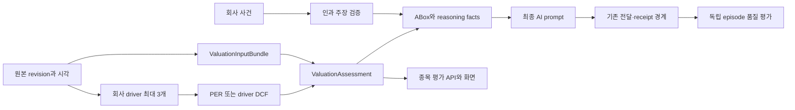

# 정확성 우선 투자 비서 IN-08~16 통합 보고서

- 기준일: 2026-09-25, Asia/Seoul
- 범위: 재현 가능한 평가, 회사 driver, 가격 인과 검증, DCF·reverse DCF, 그래프·AI·UI 연결, 격리 배포, 사후 품질 평가
- 출시 상태: 코드와 계약은 구현 완료. 투자 모델의 운영 승격과 투자 성과 실증은 미완료다.

## 결론

이 구조는 구현 가능하며 이번 변경으로 계산부터 표현까지 한 경로로 연결했다. 다만 데이터가 없는 부분을 모델이 추측해서 메우지 않는다. 현재 종목에 exact source revision, 회사의 통화·차입 노출, 조정 가격 반응, DCF driver가 없으면 각각 `partial`, `unresolved`, `reference-only` 또는 `blocked`가 된다.

따라서 이번 작업이 보장하는 것은 **같은 입력이면 같은 계산이 나오고, 근거가 부족하면 투자 행동 근거로 사용되지 않는 구조**다. 미래 적정가가 정확하다는 보장이나 운영 종목 전체에 DCF가 즉시 제공된다는 뜻은 아니다.

## 구현된 흐름

### IN-08 재현 가능한 평가 snapshot

`valuation-input-bundle-v1`은 종목·증권선·통화, 평가 시각, knowledge cutoff, 기준 가격, source snapshot, 정규화 관측값, 가정, 제외 항목, 모델·계산 버전과 exact source revision vector를 고정한다. material fingerprint는 계산 의미를, audit fingerprint는 수집 lineage까지 포함한다.

동일 bundle·모델·가정은 동일 assessment ID를 만든다. `fetchedAt`만 바뀌면 audit 변화로 분류되고 material 변화나 새 고객 메시지 사유가 되지 않는다. exact revision이 사라지면 최신 값을 대신 사용하지 않고 `partial` 및 decision-ineligible로 낮춘다.

기존 valuation row 필드는 그대로 유지하고 아래 optional 필드를 추가했다.

| 새 필드 | 의미 | 이전 reader |
| --- | --- | --- |
| `valuationBundle`, `valuationBundleId` | 동결된 입력과 식별자 | 무시 가능 |
| `valuationAssessment`, `valuationAssessmentId` | 계산 결과와 적격성 | 무시 가능 |
| `valuationAuditFingerprint` | lineage 포함 변경 | 무시 가능 |
| `valuationMaterialFingerprint` | 판단 의미 변경 | 무시 가능 |
| `valuationReproducibilityState/Gaps` | 재현 가능 여부 | 무시 가능 |

### IN-09 회사·금리·환율과 사업 변수

기간·범위·source revision 계약을 통과한 연간 재무 행에서 매출 성장, 영업이익률, capex·재투자까지 최대 3개 driver를 만든다. 공급자가 공식 공시인지 집계 데이터인지는 source reference에 그대로 남기며 둘을 같은 source trust로 표현하지 않는다. 각 driver는 기간, 단위, observation ID, revision, 영향을 받는 모델 입력을 보존한다. 현금흐름표의 음수 capex는 원래 부호를 보존한 채 DCF 입력용 양의 현금유출 크기로 명시적으로 정규화한다.

금리와 환율은 거시값이 존재한다는 이유만으로 기업 영향으로 바꾸지 않는다. 기업별 `businessExposures`에 통화 매출·비용, 헤지, 차입금리 노출 revision이 있어야 연결한다. 이 정보가 없으면 `company-currency-exposure-missing` 또는 `company-debt-rate-exposure-missing`을 반환한다. 계좌의 원화 환산 효과와 회사 영업 효과도 섞지 않는다.

### IN-10 가격 원인 검증

가격 설명은 네 단계로 제한한다.

| 상태 | 허용되는 표현 |
| --- | --- |
| `observed-event` | 사건과 가격 움직임이 관측됨 |
| `supported-mechanism` | 회사 driver에 영향을 주는 기제가 근거로 연결됨 |
| `causal-hypothesis` | 시각·조정 반응·대안 설명을 갖춘 제한적 가설 |
| `unresolved` | 원인을 확인하지 못함 |

사건 발표 시각이 가격 반응보다 늦거나, 세션·조정 수익률·시장 및 업종 비교·독립 source family·대안 설명이 부족하면 특정 사건을 주가 원인으로 확정하지 않는다. 기업가치 영향과 실제 주가 원인은 별도 결과로 유지한다.

### IN-11~12 driver DCF와 reverse DCF

DCF는 외부 API나 DB를 호출하지 않는 순수 함수다. 연도별 매출, EBIT margin, 세율, 감가상각, capex, 운전자본 투자로 아래 FCFF를 계산한다.

`FCFF = EBIT × (1 - tax rate) + D&A - capex - ΔNWC`

현금·비영업자산·부채·우선권·비지배지분은 equity bridge에서 따로 계산한다. 현금흐름 시점과 stub fraction, WACC, terminal 성장률, SBC 정책, 희석 주식 수, source revision 및 가정 승인 상태를 입력으로 요구한다. `WACC <= terminal growth`, 통화 불일치, 유효하지 않은 주식 수, 중요한 누락, 과도한 terminal 비중은 차단하거나 reference-only로 낮춘다.

독립 닫힌 식 fixture에서 5년 FCFF 10, WACC 10%, terminal growth 0%, 현금 10, 주식 수 10은 영업가치 100, 지분가치 110, 주당가치 11을 반환한다.

reverse DCF는 다른 가정을 고정하고 매출 성장률 한 변수만 이분법으로 푼다. 탐색 구간 안에 해가 없거나 forward DCF가 유효하지 않으면 숫자를 만들지 않는다. 결과는 시장 참여자의 실제 기대 관측값이 아니라 “고정된 가정 아래 현재 가격과 일치하는 성장률”로 표시한다.

DCF 입력은 `externalSignals.driverDcfInputs[symbol]`에 명시적으로 제공될 때만 registry에 추가된다. 차단된 DCF가 기존 PER 결과를 가리지 않으며 두 모델 값을 평균내지 않는다.

### IN-13~14 그래프·AI·화면 연결

기존 TBox 의미를 사용해 `valuation-input-bundle`과 `valuation-assessment` ABox entity를 추가하고 `USES_VALUATION_INPUT`, `HAS_VALUATION`, `DERIVED_FROM_VALUATION_ASSUMPTION` 관계로 연결했다. 평가 ID와 fingerprint는 relation facts, AI decision brief, 실제 queue material fingerprint에 남는다.

AI prompt에는 다음 제약을 추가했다.

- 같은 bundle/assessment의 수치·기간·가정만 함께 설명한다.
- 재현 상태가 `reproducible`이 아니면 확정 목표가나 행동 근거로 표현하지 않는다.
- DCF와 PER의 차이를 평균내지 않고 가정과 reference 상태를 분리한다.
- `supported-mechanism`을 실제 가격 원인으로 바꾸지 않는다.
- `causal-hypothesis`에는 사건 시각, 조정 반응과 대안 설명이 필요하다.

기존 종목 valuation API에는 `identity`, `inputSnapshot`, `models`, `impliedExpectations`, `investmentAnalysis`를 additive하게 추가했다. 화면은 새 사실, 이전 평가와 차이, 가격 설명 상태, 모델별 결과, 다음 확인 항목을 보여준다. 내부 code는 사용자용 한국어 label로 변환하며 화면은 자체 평가나 매매 행동을 계산하지 않는다.

고객 메시지 후보는 material 평가 변화나 검증된 가격 원인 claim이 있을 때만 true다. 단순 lineage 갱신이나 미확인 가격 변동은 반복 메시지 사유가 되지 않는다.

### IN-15 격리 비교와 rollback

후보 release manifest는 별도 graph DB, queue namespace, cache namespace, 모든 resource budget, immutable source bundle, rollback artifact를 요구한다. 후보에는 알림 생성·enqueue·transport capability를 허용하지 않는다.

paired comparison은 baseline과 candidate의 source bundle, observation clock, 계좌, 종목, security line이 같을 때만 비교한다. 허용 목록 밖의 assessment 차이, active pointer 변경, 후보 전달 side effect는 실패다. rollback receipt는 active/read pointer 복원과 실패 release의 pending job이 superseded됐는지 확인한다.

현재는 실제 후보에 제공할 적격 DCF source bundle과 독립 미래 표본이 부족하므로 운영 release pointer를 바꾸지 않았다. 이 상태에서 강제로 shadow를 성공 처리하면 빈 표본을 성공으로 오인하게 된다.

### IN-16 품질 평가

평가는 같은 사건에서 파생된 여러 메시지를 하나의 독립 episode로 계산한다. 미래 정보를 사용한 replay와 source revision이 없는 legacy/partial replay는 실증 표본에서 제외한다. 아래 항목을 따로 집계한다.

- source trace 완결률과 계산 재현률
- 근거 없는 claim 비율과 중복 전달 비율
- 중요 사건 포착률과 AI 실패율
- 사용자 유용성 피드백
- source부터 전달까지 latency와 AI token 비용

확대 상태는 자동 승격이 아니라 `manual-review-required` 또는 `remain-limited-or-reference`로만 반환한다. 개발 테스트 통과는 표본 수 gate를 충족시키지 않는다.

## 현재 데이터로 가능한 범위

| 기능 | 현재 데이터가 있으면 | 없을 때 |
| --- | --- | --- |
| PER 평가 | 동일 horizon·basis EPS와 검증된 비교 배수로 계산 | bootstrap/reference-only |
| 회사 driver | 공식 보고서의 검증된 annual observation 사용 | 빈 driver와 부족 이유 |
| 환율·금리 영향 | 기업별 노출 revision이 있을 때만 연결 | unresolved |
| 가격 원인 | 정밀 event clock과 조정 반응이 있을 때 제한적 claim | unresolved |
| DCF | 명시적 driver bundle과 승인 가정으로 계산 | 모델 미노출 또는 blocked |
| reverse DCF | 유효한 DCF bundle과 기준가격으로 역산 | unavailable/blocked |
| 고객 알림 | material 판단 변화 또는 적격 인과 claim | 반복 발송하지 않음 |

정확한 평가를 확대하려면 공식 공시의 세부 현금흐름·주식 보상·순부채 revision, 회사별 매출·비용 통화 노출과 차입 구조, 동일 증권선의 조정 가격과 시장·업종 benchmark, horizon이 명확한 컨센서스 및 비교기업 표본이 계속 들어와야 한다. 이 입력은 원본 시각과 revision을 보존해야 하며, 단순 최신 scalar API만 연결해서는 재현성과 인과 검증을 만족할 수 없다.

## 검증과 출시 경계

자동 테스트는 다음을 포함한다.

- 동일 입력의 bundle/assessment ID 안정성 및 lineage-only 변화
- source revision 누락 시 fail-closed
- UI API와 ABox의 동일 ID
- 사건 후행·독립 source 중복·대안 설명이 있는 인과 fixture
- DCF 주당 11 닫힌 식, WACC·현금·통화·terminal 오류
- reverse DCF 해 복원과 bracket 실패
- 후보 delivery capability 0, frozen paired comparison, rollback pointer
- 독립 episode 집계와 미래 정보 누출 차단
- 프런트의 정상·reference-only·미확인 상태 표시

운영 release 승격 조건은 여전히 별개다. 실제 종목별 적격 source bundle, 격리 candidate runtime, 사전에 정한 resource budget, 미래 독립 episode가 확보될 때 IN-15 비교와 IN-16 관측을 실행한 뒤 수동 검토한다.

### 2026-09-25 운영 read-only 확인

로컬 운영 snapshot의 AAPL, 035720, NVDA를 새 valuation API로 읽었다. 세 종목 모두 exact input bundle로 계산 재현은 가능했지만 비교 PER 표본 수가 0인 bootstrap band여서 `valuationDecisionEligible=false`였다. 사건·조정 가격 반응 연결이 없어 가격 원인은 `unresolved`, 명시적 DCF driver bundle이 없어 reverse DCF는 `unavailable`, 과거 driver/assessment 비교 기록이 없어 `customerMessageEligible=false`였다.

화면에서도 초기 가격 범위는 “투자 판단에는 참고만”, 원인은 “가격 원인 확인 불가”로 표시됐다. 최근 EPS 기간은 forecast horizon과 섞이지 않고 TTM으로 표시됐으며, 현금흐름표의 음수 capex는 AAPL `-12,715,000,000 USD`를 원본으로 보존하면서 화면과 DCF driver에서는 `12,715,000,000 USD` 현금유출로 표시했다. 이 확인은 데이터 준비도를 기록한 것이며 모델 승격이나 투자 정확도 실증이 아니다.

### 2026-09-26 운영 과거 선행 PER 공급 경로

운영 MySQL에 이미 보존된 `yfinance.fundamental`과 `yfinance.analyst`의 immutable revision을
시점 기준으로 결합하는 공급기를 추가했다. 가격 snapshot보다 늦게 관측된 컨센서스는 사용하지
않고, 컨센서스 관측 후 14일이 지난 가격도 제외한다. 같은 주의 반복 polling은 가장 늦은 완전
관측 하나로 축약해 표본 수를 부풀리지 않는다. 각 관측은 가격 revision과 analyst revision을 모두
`sourceReferences`에 보존하며, 계산식은 `price / point-in-time FY1 EPS consensus`다.

공급자가 basic/diluted와 회계 기준을 명시하지 않은 값은
`provider-reported-unspecified`로 기록한다. 이는 basis가 확인됐다는 주장이 아니다. 현재 FY1
컨센서스와 과거 표본이 같은 공급자 계약, 통화, security line 및 이 명시적 unknown basis를
공유할 때만 서로 비교한다. 서로 다른 명시적 basis와 섞이지 않으며 공급자 unknown을 공식
공시 EPS로 승격하지 않는다.

읽기 모델은 `valuationEvidenceFeeds[symbol]`에 표본 수, 최소 3개 충족 여부, 주간 sampling 및
look-ahead 차단 상태를 노출한다. AAPL, NVDA, 035720의 현재 보존 데이터에는 각각 7개 주간
표본이 있어 bootstrap 대신 historical 사분위 밴드를 계산했다. 세 종목의 valuation 입력과
재현 상태는 `sufficient`가 됐지만 모델 상태는 여전히 `ai_applied_pending_review`다. 데이터가
충분하다는 사실이 모델 승인이나 투자 행동 권한을 자동으로 만들지 않는다. DCF, 기업별 금리·환율
노출, 사건별 조정 가격 반응은 각자의 입력 계약이 아직 필요하다.

### 2026-09-26 운영 shadow DCF와 내재 기대 역산

첫 DCF 운영 대상은 비금융기업 NVDA 한 종목으로 제한했다. 보존된 연간 재무 revision에서 매출,
영업이익, 세전이익, 법인세, 이자비용, 감가상각, 설비투자, 운전자본 변화, 주식보상비용, 현금,
부채와 희석 가중평균 주식 수를 읽는다. FY1·FY2 매출은 같은 시점에 보존된 analyst revision을,
무위험금리는 USD 평가 통화와 일치하는 FRED DGS10 revision을 사용한다. 세 source revision이 모두
없거나 필수 재무 항목 하나라도 없으면 `driverDcfInputs`를 만들지 않고 준비도에 누락 이유를 남긴다.

현금흐름표의 운전자본 변화는 현금 기여 부호이므로 FCFF의 경제적 투자액에는 반대 부호로
정규화한다. WACC는 관측된 국채금리·beta·자본구조·이자비용과 versioned equity risk premium
가정으로 계산한다. 1~2년 매출은 컨센서스이고 3~5년 성장률 fade, 일정 영업이익률·재투자율,
terminal 성장률, 우선주와 비지배지분 0 가정은 모두 `candidate`로 분리한다. 이 가정들이 검토되지
않았으므로 모델은 `shadow`, `valuationDecisionEligible=false`이며 근거가 충족된 PER 모델을 주
평가에서 밀어내지 않는다.

현재 운영 revision으로 NVDA DCF는 조건부 주당가치 약 125.78 USD를 계산했고, 같은 고정 가정에서
현재가 225 USD와 일치하는 5년 일정 매출 성장률은 약 62.50%로 역산됐다. 두 값은 장기 가정 검토를
위한 민감도와 질문 생성용이다. 적정가 승인이나 시장 참여자의 실제 기대 관측으로 표현하지 않으며,
화면은 별도 모델에 `가정 검토 필요`를 표시한다. 공식 공시 기반 DCF 재무 revision 확대, 장기 가정
승인, terminal 의존도 검토와 독립 미래 관측이 끝나기 전에는 투자 행동 근거로 승격하지 않는다.
