# Versioned Reasoning And Time-Series Platform

## Purpose

Orbit Alpha now separates three concerns that used to move together:

1. Investment reasoning engine releases (`V1`, `V2`, and later `V3`).
2. Temporal feature generation used by those engines.
3. The database product that stores market history.

An engine release no longer imports a MySQL or QuestDB driver. It reads a
versioned temporal feature packet through the domain port. Database migration
and reasoning-engine promotion therefore have independent rollback controls.

## Runtime Flow

```mermaid
flowchart LR
    Sources[Market and account sources] --> MySQL[(MySQL operational source)]
    MySQL --> Outbox[Time-series projection outbox]
    Outbox --> Projection[Projection worker]
    Projection --> QuestDB[(QuestDB shadow)]
    MySQL --> ActivePort[Active time-series port]
    QuestDB -. after promotion .-> ActivePort
    ActivePort --> Feature[Immutable TemporalFeatureSnapshot]
    Feature --> V1[V1 active TypeDB reasoning]
    V1 --> Frozen[Immutable source and outcome packet]
    Frozen -. durable shadow queue .-> V2[V2 isolated TypeDB reasoning]
    Feature -. MySQL and QuestDB parity .-> V2
    V1 --> Delivery[Notification delivery]
    V2 -. delivery forbidden .-> Compare[Parity and outcome comparison]
    Compare --> Gate{Promotion gate}
    Gate -->|approved| Delivery
```



## Current Deployment

- `mysql-primary`: active temporal read backend and durable compatibility source.
- `questdb-shadow`: live shadow write target. It cannot affect investment
  judgement while MySQL remains active.
- `ontology-v1-active`: active and delivery-authorized reasoning deployment.
- `ontology-v2-shadow`: isolated candidate deployment in
  `orbit_alpha_ontology_shadow_v2`. It replays the exact bounded source packet
  consumed by V1, reads the QuestDB temporal binding, and cannot access a real
  notification transport.

V2 deliberately starts with the same approved TBox and TypeDB schema-function
RuleBox as V1. Its first job is to prove that the version boundary, alternate
time-series binding, independent graph database, and deployment controls are
real. A later V2 rule or prompt change can then be measured against V1 instead
of being released on trust. The RuleBox fingerprint is frozen after the first
successful V2 comparison; a changed RuleBox requires a new candidate release
so results from different releases cannot be mixed.

The final AI boundary uses the engine-neutral `DecisionContinuityPacket` v2.
It carries the prior decision identity, selected hypothesis, follow-up state,
observed account action, outcome, execution feedback, and lifecycle review as
one bounded immutable input. This separates an engine upgrade from memory
semantics: V1 and a future AI-enabled V2 comparison must receive the same
packet fingerprint before their decisions are compared. The current TypeDB
shadow remains a graph-only comparison and therefore does not claim AI-decision
parity until that additional promotion gate is enabled.

## Shadow Comparison Contract

The active reasoning worker stores one bounded immutable handoff after a successful V1
generation. It contains the source monitor state selected by V1, source
snapshot identifiers, target account and symbols, graph-backed alert
candidates, TypeDB projection receipts, and a compressed projection-runtime
context packet. The runtime packet freezes only the allowlisted financial,
evidence, policy, and temporal inputs that V1 actually read; connection
settings, credentials, API keys, and notification transports are excluded.
V1 constructs its graph from that filtered context too. Filtering only the V2
packet is invalid because it gives the engines different factual inputs.

V1 first rehydrates that bounded packet and uses it for its own TypeDB
projection. V2 receives the same packet byte-for-byte; the shadow contract
therefore compares engines rather than an unbounded V1 input with a compacted
V2 input.

The low-priority V2 worker:

1. starts only while the active inference queue is empty by default;
2. claims the latest job for an account/symbol scope;
3. replays the packet into the isolated TypeDB database;
4. compares MySQL and QuestDB temporal feature snapshots at the same `as_of`;
5. compares the target-symbol scope closure, rule slots, evidence, selected
   decisions, and latency;
6. records every difference in MySQL and records any attempted shadow delivery
   as a promotion-blocking violation.

The comparison scope starts from the exact symbols used to construct V1's
graph, then follows their declared dependency scopes. Symbols later added by
impact routing remain visible as inference targets, but they do not silently
expand the source-fact comparison boundary. Unrelated account symbols are
deliberately excluded, so a
V1/V2 result is not marked different merely because their isolated databases
retain different older generations. Graph-assembly caches persist the same
compressed runtime packet with the graph, allowing a restarted worker to
replay the exact V1 inputs instead of querying newer MySQL state.
Cache reuse requires the complete observation clock and provider provenance as
well as values and policy context. Material-generation fingerprints may ignore
polling timestamps, but a graph cache must not: `generatedAt`, `asOf`, or a
provider timestamp can change freshness, market-session, flow, and data-quality
facts even when the last price is unchanged.

Older queued work for the same scope is superseded. Completed jobs and
comparison history have independent retention policies, so the durable source
archive remains MySQL while TypeDB retains only active reasoning state.
The scheduler takes the union of requested symbols and the symbols actually
evaluated in V1's TypeDB receipt. A newer packet supersedes older queued work
for the same account set, even when graph impact routing expanded the symbols.
An expired `processing` lease is returned to `retry`, preventing a terminated
shadow worker from leaving a permanent queue entry. The default 60-minute
lease includes the one-time empty-database TBox bootstrap.
The first provisioning comparison is retained for audit but excluded from the
steady-state p95 latency promotion gate.
Legacy or malformed jobs without a verifiable V1 projection receipt, source
state, or runtime context are terminally discarded as `invalid-input`; they
are not retried and cannot block the queue.

## Storage Contract

`domain/time_series_storage.py` owns the vendor-neutral interfaces:

- ingest observations;
- read point-in-time temporal windows;
- report a watermark and health;
- describe backend capabilities;
- create deterministic feature snapshots.

QuestDB uses one WAL table per granularity so the retention contract is real:

| Table | Granularity | TTL |
| --- | --- | --- |
| `market_observations_3m` | 3 minutes | 2 days |
| `market_observations_15m` | 15 minutes | 10 days |
| `market_observations_1h` | 1 hour | 90 days |
| `market_observations_1d` | 1 day | 180 days |
| `portfolio_marks` | account marks | 2 days |

Account identity and position-at-observation fields are retained so replay has
the same account-first, shared-market-fallback semantics as MySQL.

## Failure Isolation

The active MySQL transaction writes the baseline observation and a durable
outbox record. QuestDB writes use its ILP ingestion endpoint in the projection worker. A QuestDB
timeout therefore creates a retry with a lease and exponential backoff; it
does not fail account monitoring or TypeDB inference.

Completed projection payloads are retained for 6 hours. Temporal feature
snapshots are retained for 24 hours. The existing minimal MySQL retention
worker removes older records in bounded batches.

## Promotion Rules

A reasoning candidate cannot become active unless all of these hold:

- deployment status is `candidate`;
- engine health is ready;
- the minimum configured number of comparisons and distinct symbols is met;
- fact parity is 100 percent;
- rule-slot coverage is 100 percent;
- there are no unexplained decision differences;
- the shadow deployment has delivered zero notifications;
- the comparison window is fresh and candidate p95 latency is within the
  configured ratio to V1.

`candidate` and `promote` commands calculate these gates from stored comparison
history. Operators do not provide hand-written parity values.

Time-series promotion must separately prove backend health, an empty pending
projection queue, acceptable watermark lag, and temporal feature parity on a
representative account/symbol replay set. The active backend setting and the
control row must be changed together. Rollback reverses only the storage
binding; it does not alter TBox, RuleBox, prompts, or engine deployment.

## Operations

```bash
npm run python:time-series:status
npm run python:time-series:backfill -- --backend-id questdb-shadow --batch-size 50
npm run python:time-series:project-once
npm run python:time-series:compare -- --account-id <account> --symbols 005930,NVDA
python3 python_service/service.py time-series-platform candidate --backend-id questdb-shadow
python3 python_service/service.py time-series-platform promote --backend-id questdb-shadow --account-id <account> --symbols 005930,NVDA
python3 python_service/service.py time-series-platform rollback
npm run python:reasoning-engine:status
npm run python:reasoning-engine:shadow
npm run python:reasoning-engine:comparisons
python3 python_service/service.py reasoning-engine candidate --deployment-id ontology-v2-shadow
python3 python_service/service.py reasoning-engine promote --deployment-id ontology-v2-shadow
python3 python_service/service.py reasoning-engine rollback
```

Read-only HTTP status is also available:

- `GET /api/time-series-platform/status`
- `GET /api/reasoning-engine/status`
- `GET /api/reasoning-engine/comparisons`

Runtime settings select bindings without leaking database details into the
domain:

- `TIME_SERIES_ACTIVE_BACKEND_ID`
- `TIME_SERIES_SHADOW_BACKEND_ID`
- `TIME_SERIES_QUESTDB_ENABLED`
- `REASONING_ENGINE_ACTIVE_DEPLOYMENT_ID`
- `REASONING_ENGINE_DELIVERY_DEPLOYMENT_ID`
- `REASONING_ENGINE_CANDIDATE_DEPLOYMENT_ID`
- `REASONING_ENGINE_ACTIVE_RELEASE_ID`
- `REASONING_ENGINE_CANDIDATE_RELEASE_ID`
- `REASONING_ENGINE_SHADOW_ENABLED`
- `REASONING_ENGINE_SHADOW_TYPEDB_DATABASE`
- `REASONING_ENGINE_PROMOTION_MINIMUM_COMPARISONS`
- `REASONING_ENGINE_PROMOTION_MINIMUM_SYMBOLS`
- `REASONING_ENGINE_PROMOTION_MINIMUM_NATIVE_INFERENCE_SAMPLES`
- `REASONING_ENGINE_PROMOTION_MINIMUM_DECISION_SAMPLES`
- `REASONING_ENGINE_PROMOTION_MINIMUM_MATCHED_RULES`
- `REASONING_ENGINE_PROMOTION_MINIMUM_MARKET_CLASSES`
- `REASONING_ENGINE_PROMOTION_MAXIMUM_CANDIDATE_P95_MS`
- `REASONING_ENGINE_PROMOTION_MAXIMUM_QUEUE_WAIT_P95_MS`

## Immutable Release Cohorts

A deployment name such as `ontology-v2-shadow` is a stable slot, not a
validation identity. Every comparison is bound to a fingerprint containing
the runtime revision, TBox, RuleBox, prompt, temporal feature set, source
contracts, graph/time-series bindings, and the concrete RuleBox hash. Any
change starts a new `validationCohortId`. Promotion status and the default HTTP
comparison view read only that cohort; older rows remain historical audit data.

Queued shadow jobs carry the same immutable release identity. A worker claims
only jobs for its current logical release and runtime revision, then verifies
the full fingerprint before TypeDB execution. Old jobs are never replayed by a
new code release.

## Substantive Promotion Evidence

Parity by itself is not sufficient because two empty outputs can be 100%
equal. Promotion additionally requires configurable minimums for:

- comparisons and distinct symbols;
- samples with at least one TypeDB native match;
- samples with at least one user-facing decision candidate;
- distinct matched RuleBox rules and market classes;
- absolute candidate p95 runtime and shadow queue-wait p95;
- zero delivery attempts and no unexplained differences.

Comparison rows keep bounded per-phase timings for projection and TypeDB native
execution. These timings are operational evidence only and never become
investment facts.

## Native Preflight Read Policy

The projection worker passes its just-persisted, manifest-verified ABox graph
to native rule execution. A complete target graph can prove negative
conditions. A verified partial graph may optimize only the subjects it
contains; missing subjects stay unknown, so their rules cannot be pruned.
TypeDB still evaluates every surviving rule and remains the sole investment
rule evaluator.

The expensive durable ABox reread is disabled in the realtime path by default
with `TYPEDB_NATIVE_RULE_DURABLE_PREFLIGHT_FALLBACK_ENABLED=0`. It can be
enabled for diagnostics or a controlled rollback without changing inference
semantics.

## Adding V3 Or Another Database

For V3, implement `InvestmentReasoningEngine`, register a new immutable release
bundle, replay the same feature snapshots, and pass the existing promotion
gate. Do not add `if version == ...` branches to investment domain code.

For another time-series database, implement the ingest, query, and lifecycle
ports, register its descriptor in the infrastructure factory, and project the
same canonical observations. Domain and application code must not import the
new vendor SDK.
