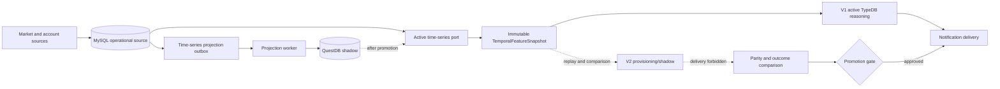

# Versioned Reasoning And Time-Series Platform

## Purpose

Orbit Alpha now separates three concerns that used to move together:

1. Investment reasoning engine releases (`V1`, `V2`, and later `V3`).
2. Temporal feature generation used by those engines.
3. The database product that stores market history.

An engine release no longer imports a MySQL or QuestDB driver. It reads a
versioned temporal feature packet through the domain port. Database migration
and reasoning-engine promotion therefore have independent rollback controls.

## Runtime Flow



## Current Deployment

- `mysql-primary`: active temporal read backend and durable compatibility source.
- `questdb-shadow`: live shadow write target. It cannot affect investment
  judgement while MySQL remains active.
- `ontology-v1-active`: active and delivery-authorized reasoning deployment.
- `ontology-v2-shadow`: provisioning deployment. It has no notification
  delivery capability and cannot be promoted without comparison evidence.

The current TypeDB inference implementation remains V1. Registering V2 does
not pretend that a second inference implementation is already validated. It
creates the isolated release slot, bindings, and promotion contract needed to
build and replay V2 without changing V1.

## Storage Contract

`domain/time_series_storage.py` owns the vendor-neutral interfaces:

- ingest observations;
- read point-in-time temporal windows;
- report a watermark and health;
- describe backend capabilities;
- create deterministic feature snapshots.

QuestDB uses one WAL table per granularity so the retention contract is real:

| Table | Granularity | TTL |
| --- | --- | --- |
| `market_observations_3m` | 3 minutes | 2 days |
| `market_observations_15m` | 15 minutes | 10 days |
| `market_observations_1h` | 1 hour | 90 days |
| `market_observations_1d` | 1 day | 180 days |
| `portfolio_marks` | account marks | 2 days |

Account identity and position-at-observation fields are retained so replay has
the same account-first, shared-market-fallback semantics as MySQL.

## Failure Isolation

The active MySQL transaction writes the baseline observation and a durable
outbox record. QuestDB writes use its ILP ingestion endpoint in the projection worker. A QuestDB
timeout therefore creates a retry with a lease and exponential backoff; it
does not fail account monitoring or TypeDB inference.

Completed projection payloads are retained for 6 hours. Temporal feature
snapshots are retained for 24 hours. The existing minimal MySQL retention
worker removes older records in bounded batches.

## Promotion Rules

A reasoning candidate cannot become active unless all of these hold:

- deployment status is `candidate`;
- engine health is ready;
- fact parity is 100 percent;
- rule-slot coverage is 100 percent;
- there are no unexplained decision differences;
- the shadow deployment has delivered zero notifications.

Time-series promotion must separately prove backend health, an empty pending
projection queue, acceptable watermark lag, and temporal feature parity on a
representative account/symbol replay set. The active backend setting and the
control row must be changed together. Rollback reverses only the storage
binding; it does not alter TBox, RuleBox, prompts, or engine deployment.

## Operations

```bash
npm run python:time-series:status
npm run python:time-series:backfill -- --backend-id questdb-shadow --batch-size 50
npm run python:time-series:project-once
npm run python:time-series:compare -- --account-id <account> --symbols 005930,NVDA
python3 python_service/service.py time-series-platform candidate --backend-id questdb-shadow
python3 python_service/service.py time-series-platform promote --backend-id questdb-shadow --account-id <account> --symbols 005930,NVDA
python3 python_service/service.py time-series-platform rollback
npm run python:reasoning-engine:status
```

Read-only HTTP status is also available:

- `GET /api/time-series-platform/status`
- `GET /api/reasoning-engine/status`

Runtime settings select bindings without leaking database details into the
domain:

- `TIME_SERIES_ACTIVE_BACKEND_ID`
- `TIME_SERIES_SHADOW_BACKEND_ID`
- `TIME_SERIES_QUESTDB_ENABLED`
- `REASONING_ENGINE_ACTIVE_DEPLOYMENT_ID`
- `REASONING_ENGINE_DELIVERY_DEPLOYMENT_ID`
- `REASONING_ENGINE_CANDIDATE_DEPLOYMENT_ID`

## Adding V3 Or Another Database

For V3, implement `InvestmentReasoningEngine`, register a new immutable release
bundle, replay the same feature snapshots, and pass the existing promotion
gate. Do not add `if version == ...` branches to investment domain code.

For another time-series database, implement the ingest, query, and lifecycle
ports, register its descriptor in the infrastructure factory, and project the
same canonical observations. Domain and application code must not import the
new vendor SDK.
