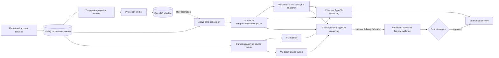

# Versioned Reasoning And Time-Series Platform

## Purpose

Orbit Alpha now separates three concerns that used to move together:

1. Investment reasoning engine releases (`V1`, `V2`, and later `V3`).
2. Temporal feature generation used by those engines.
3. The database product that stores market history.

An engine release no longer imports a MySQL or QuestDB driver. It reads a
versioned temporal feature packet through the domain port. Database migration
and reasoning-engine promotion therefore have independent rollback controls.

## Runtime Flow



## Current Deployment

- `mysql-primary` and `questdb-shadow` are stable deployment identifiers, not
  permanent role names. Their current role comes from the time-series control
  plane (`activeBackendId`, `shadowBackendId`, and `deliveryBackendId`).
- Investment-model projections and reasoning deployments use the live
  control-plane role. A stored release binding remains available for audit and
  is reported as a mismatch only when it differs from the active backend.
- `ontology-v1-active`: active and delivery-authorized reasoning deployment.
- `ontology-v2-shadow`: independently executable candidate deployment in
  `orbit_alpha_ontology_shadow_v2`. The same durable source event is inserted
  directly into its own leased queue in the source transaction. It does not
  wait for V1, construct `MonitorRunner`, or consume a V1 result. While shadow
  or candidate, delivery authorization is false even if it produces an alert
  candidate.

V2 can reuse an approved TBox/RuleBox release while retaining independent
input assembly, scoped TypeDB projection/inference, candidate construction,
health, and delivery handoff. This is reuse of domain contracts, not a call
into V1. A later V3 can replace any of these stages behind the same engine and
source-event contracts.

The temporal feature set and statistical model release are separate release
coordinates. A reasoning release fingerprint includes both. Six production
model families emit deterministic exact-contract evidence without probabilities
or investment-action authority. MySQL stores immutable changed snapshots and
one latest head per account, subject, signal type, and model release. TypeDB
receives compact signal, exact hypothesis-contract, model-release,
feature-reference, and eligibility ABox concepts. Raw predictive market
predicates are retained in the governed source catalog for audit but are not a
runtime fallback.

## InvestmentReasoning Module

Inference, hypotheses, and AI judgement form one logical bounded context named
`InvestmentReasoning`. They are one traceable decision process, but remain
separate runtime workers so a slow AI call cannot hold a TypeDB lease and a
TypeDB retry cannot duplicate an outbound notification.

```mermaid
flowchart LR
    Delta[FactDelta] --> Case[ReasoningCase]
    Case --> Input[Point-in-time input]
    Input --> TypeDB[TypeDB native inference]
    TypeDB --> Hypotheses[Graph hypothesis set]
    Hypotheses --> Synthesis[Decision synthesis: alternatives and action envelope]
    Synthesis --> AIQueue[Durable AI queue]
    AIQueue --> AI[AI judgement]
    AI --> Validate[Contract validation]
    Validate --> Notify[Notification queue]
    Notify --> Published[Delivered and published]
```



One durable `ReasoningCase` carries the request ID, changed fact families,
execution lane, source ABox snapshot IDs, inference generation IDs, competing
hypotheses, TypeDB-authored action alternatives, AI request/result, final
action, and stage history. The lifecycle is `CREATED -> INPUT_READY ->
INFERENCE_COMPLETED -> HYPOTHESES_READY -> DECISION_SYNTHESIZED -> AI_PENDING
-> AI_COMPLETED -> VALIDATED -> PUBLISHED`. Shadow or no-delivery
executions end at `COMPLETED`; retryable point-in-time gaps use `DEFERRED`;
invalid graph/AI contracts use `BLOCKED`.

`DecisionSynthesis` is not a second rules engine. It freezes the current
InferenceBox generation, eligible and reference-only hypotheses, candidate
action, allowed and blocked actions, counter-evidence, invalidation conditions,
and trace identifiers into a deterministic handoff. Python neither ranks the
alternatives nor derives a new investment action.

The AI worker may select and explain only a decision-eligible hypothesis
already present in the TypeDB-derived hypothesis set. An empty set, an unknown
or reference-only selected hypothesis, an action blocked by the TypeDB action
envelope, or an invalid action blocks publication. `VALIDATED` means the AI result was
accepted and the notification was returned to the delivery queue;
`PUBLISHED` is recorded only after the channel confirms delivery.

`reasoning_engine_jobs` owns worker leasing. Every claimed job is bound to the
current release fingerprint and validation cohort, and its lease is extended
by heartbeat during TypeDB execution. Historical releases remain visible for
audit but p95 execution/failure evidence is calculated from the current
release cohort. Operational pending counts intentionally cover all releases
so old work cannot disappear from queue health.

Fact changes use three execution lanes without changing inference semantics:

| Lane | Typical input | Default batch |
| --- | --- | --- |
| `REALTIME` | price, trade, order book, investor flow, PnL | 1 |
| `CONTEXT` | financials, disclosures, research, macro context | 3 |
| `RECONCILIATION` | backfill, maintenance, consistency repair | 6 |

The lane controls scheduling and bounded batching only. TypeDB still evaluates
the applicable graph rules and produces the hypothesis set.

`reasoning_engine_jobs` is the V2 source inbox. Latest-state work can supersede
an older queued revision in the same scope; non-fungible governance and
research work is retained. Jobs use leases, bounded retries, queue-wait and
stage timings, input fingerprints, source ABox IDs, inference generation IDs,
and candidate output. Terminal rows use the normal bounded MySQL retention
policy.

On a supervised local restart, the replacement V2 worker also checks the host
and PID encoded in each `processing` owner. It immediately returns only a
locally owned job whose process is confirmed absent; remote, malformed, and
ambiguous owners still wait for durable lease expiry. This removes the normal
ten-minute restart stall without weakening multi-host lease safety.

The durable inbox stores one job per symbol even when the source snapshot
contains an entire account. Every shard keeps the same immutable snapshot
boundary and only its symbol-indexed fact revisions, changed fields, and fact
contract. The first shard retains the original event ID and later shard IDs
are deterministic, so crash repair remains idempotent. At execution time the
worker may combine compatible jobs up to the native TypeDB target-symbol
limit. A legacy job wider than that limit is atomically re-sharded before
projection; it can never be partially inferred and then marked complete.

Compatible pending events are claimed as one bounded batch and projected as a
union of affected symbols. Events with a different verified snapshot boundary
are deferred to a separate turn, so batching never mixes point-in-time facts.
Stored results contain identifiers, counts, SLO violations, and stage timings;
the multi-megabyte scope plan and semantic fingerprint map stay in their
owning TypeDB/projection audit instead of being copied into every queue and
deployment-health row.

When a source event contains a verified monitor snapshot boundary, V2 reads
the exact `monitor_snapshot_history` row at that `generatedAt`. A later current
snapshot is not an acceptable replacement. This keeps delayed execution and
replay deterministic.

The final AI boundary uses the engine-neutral `DecisionContinuityPacket` v2.
It carries the prior decision identity, selected hypothesis, follow-up state,
observed account action, outcome, execution feedback, and lifecycle review as
one bounded immutable input. This separates an engine upgrade from memory
semantics. When V2 is active and delivery-authorized, its graph-backed alert
candidate enters the existing durable notification and AI queues with this
continuity packet; while shadow or candidate, that handoff is blocked.

## Legacy V1 Parity Path

The immutable V1/V2 parity runner and comparison tables remain available as a
compatibility and investigation tool. They are not the execution dependency
or promotion authority when `REASONING_ENGINE_V2_INDEPENDENT_ENABLED=1`.

## Independent V2 Contract

The independent worker performs one bounded pipeline:

1. claim a source event from `reasoning_engine_jobs`;
2. resolve account, symbol, fact-family, and point-in-time snapshot scope;
3. project that scope to the isolated V2 TypeDB database;
4. require native TypeDB completion, aligned generation IDs, source ABox IDs,
   and inference traces;
5. normalize verified InferenceBox hypotheses and action envelopes into a
   `DecisionSynthesis`, then package graph-backed candidates without calling
   the V1 `RealtimeMonitor`;
6. block delivery in shadow/candidate, or hand active candidates to the common
   notification and AI queues;
7. persist the result and update deployment health.

Input assembly, inference execution, candidate construction, and queue running
are separate application components. None imports a database driver.

Every V2 release freezes its RuleBox fingerprint. Startup fails if the RuleBox
stored in the isolated V2 TypeDB database changes under the same deployment
ID. Deployment health includes a compact rule inventory by domain module,
execution stage, lifecycle class, decision effect, disabled rules, invalid
dependency contracts, and high-cost rules. A changed RuleBox requires a new
deployment release rather than silently mixing evidence cohorts.

The release preflight also verifies the deployed TBox and freezes both TBox
metadata and the complete RuleBox catalog in the V2 worker. Per-symbol jobs
reuse that in-memory release snapshot; they do not reread or migrate static
ontology definitions. Only material ABox scopes are projected at runtime. An
unchanged scoped Manifest may reuse its aligned native inference generation,
but only when the compact result-slot proof matches the same TBox, RuleBox,
deployment namespace, source ABox, and target scope.

RuleBox migration is permitted only while a new isolated deployment is still
provisioning and has not frozen its first release fingerprint. Active,
delivery-authorized, and already-frozen candidate deployments perform a
read-only fingerprint check at startup. A mismatch fails fast and requires
restoring that immutable release or registering a successor; startup must
never rewrite the active graph store in place.

Register that successor as a rolling candidate before restarting the V2
worker:

```bash
python3 python_service/service.py reasoning-engine register-v2-release \
  --deployment-id ontology-v2-production-r14 \
  --release-id ontology-v2-release-r14
```

Registration keeps the current active and delivery deployment unchanged,
moves only the candidate pointer, and persists the configured V2 deployment
for the independent worker. The existing active descriptor remains valid in
the control plane until the new cohort passes `candidate` and `promote` gates.
Reusing a deployment ID that is currently active or delivery-authorized is
rejected.

## Shadow Comparison Contract

The active reasoning worker stores one bounded immutable handoff after a successful V1
generation. It contains the source monitor state selected by V1, source
snapshot identifiers, target account and symbols, graph-backed alert
candidates, TypeDB projection receipts, and a compressed projection-runtime
context packet. The runtime packet freezes only the allowlisted financial,
evidence, policy, and temporal inputs that V1 actually read; connection
settings, credentials, API keys, and notification transports are excluded.
V1 constructs its graph from that filtered context too. Filtering only the V2
packet is invalid because it gives the engines different factual inputs.

V1 first rehydrates that bounded packet and uses it for its own TypeDB
projection. V2 receives the same packet byte-for-byte; the shadow contract
therefore compares engines rather than an unbounded V1 input with a compacted
V2 input.

The low-priority V2 worker:

1. starts only while the active inference queue is empty by default;
2. claims the latest job for an account/symbol scope;
3. replays the packet into the isolated TypeDB database;
4. compares MySQL and QuestDB temporal feature snapshots at the same `as_of`;
5. compares the target-symbol scope closure, rule slots, evidence, selected
   decisions, and latency;
6. records every difference in MySQL and records any attempted shadow delivery
   as a promotion-blocking violation.

The comparison scope starts from the exact symbols used to construct V1's
graph, then follows their declared dependency scopes. Symbols later added by
impact routing remain visible as inference targets, but they do not silently
expand the source-fact comparison boundary. Unrelated account symbols are
deliberately excluded, so a
V1/V2 result is not marked different merely because their isolated databases
retain different older generations. Graph-assembly caches persist the same
compressed runtime packet with the graph, allowing a restarted worker to
replay the exact V1 inputs instead of querying newer MySQL state.
Cache reuse requires the complete observation clock and provider provenance as
well as values and policy context. Material-generation fingerprints may ignore
polling timestamps, but a graph cache must not: `generatedAt`, `asOf`, or a
provider timestamp can change freshness, market-session, flow, and data-quality
facts even when the last price is unchanged.

Older queued work for the same scope is superseded. Completed jobs and
comparison history have independent retention policies, so the durable source
archive remains MySQL while TypeDB retains only active reasoning state.
The scheduler takes the union of requested symbols and the symbols actually
evaluated in V1's TypeDB receipt. A newer packet supersedes older queued work
for the same account set, even when graph impact routing expanded the symbols.
An expired `processing` lease is returned to `retry`, preventing a terminated
shadow worker from leaving a permanent queue entry. The default 60-minute
lease includes the one-time empty-database TBox bootstrap.
The first provisioning comparison is retained for audit but excluded from the
steady-state p95 latency promotion gate.
Legacy or malformed jobs without a verifiable V1 projection receipt, source
state, or runtime context are terminally discarded as `invalid-input`; they
are not retried and cannot block the queue.

## Storage Contract

`domain/time_series_storage.py` owns the vendor-neutral interfaces:

- ingest observations;
- read point-in-time temporal windows;
- report a watermark and health;
- describe backend capabilities;
- create deterministic feature snapshots.

QuestDB uses one WAL table per granularity so the retention contract is real:

| Table | Granularity | TTL |
| --- | --- | --- |
| `market_observations_3m` | 3 minutes | 2 days |
| `market_observations_15m` | 15 minutes | 10 days |
| `market_observations_1h` | 1 hour | 90 days |
| `market_observations_1d` | 1 day | 180 days |
| `portfolio_marks` | account marks | 2 days |

Account identity and position-at-observation fields are retained so replay has
the same account-first, shared-market-fallback semantics as MySQL.

## Failure Isolation

The active MySQL transaction writes the baseline observation and a durable
outbox record. QuestDB writes use its ILP ingestion endpoint in the projection worker. A QuestDB
timeout therefore creates a retry with a lease and exponential backoff; it
does not fail account monitoring or TypeDB inference.

Completed projection payloads are retained for 6 hours. Temporal feature
snapshots are retained for 24 hours. The existing minimal MySQL retention
worker removes older records in bounded batches.

## Promotion Rules

A V2 independent reasoning candidate cannot become active unless all of these hold:

- deployment status is `candidate`;
- engine health is ready;
- the minimum configured number of successful V2 runs and distinct symbols is met;
- every successful run has aligned source ABox and inference generation traces;
- execution failures stay within the configured limit;
- the shadow deployment has authorized zero deliveries;
- V2 p95 execution time, queue-wait p95, oldest pending age, and latest run
  freshness are within their configured limits.

The first healthy transition from `provisioning` or `replaying` to `shadow`
records `validationStartedAt`. Promotion samples are limited to jobs completed
at or after that timestamp. Schema installation, initial release hydration, and
other one-time preparation work therefore remain visible in historical
diagnostics without contaminating the steady-state promotion SLO. Failures and
slow runs after validation starts continue to block promotion.

`candidate` and `promote` commands calculate these gates from V2's own durable
job history. V1 outcome equality is not a requirement for an independently
evolving engine. The legacy parity report remains diagnostic only.

Promotion is a runtime switch, not only a status change. Each deployment owns
an immutable TypeDB database binding. The promote/rollback command updates the
active deployment, delivery deployment, active engine version, and the TypeDB
database used by read-side services as one switch operation. A V1 runner
checks the durable control row before every turn and fails closed after V2 is
active. The service supervisor then removes the switched-out V1 process. This
prevents two engines from producing investment notifications during a restart
or rollback window.

Time-series promotion must separately prove backend health, an empty pending
projection queue, acceptable watermark lag, and temporal feature parity on a
representative account/symbol replay set. The active backend setting and the
control row must be changed together. Rollback reverses only the storage
binding; it does not alter TBox, RuleBox, prompts, or engine deployment.

## Operations

```bash
npm run python:time-series:status
npm run python:time-series:backfill -- --backend-id questdb-shadow --batch-size 50
npm run python:time-series:project-once
npm run python:time-series:compare -- --account-id <account> --symbols 005930,NVDA
python3 python_service/service.py time-series-platform candidate --backend-id questdb-shadow
python3 python_service/service.py time-series-platform promote --backend-id questdb-shadow --account-id <account> --symbols 005930,NVDA
python3 python_service/service.py time-series-platform rollback
npm run python:reasoning-engine:status
npm run python:reasoning-engine:v2
npm run python:reasoning-engine:comparisons
python3 python_service/service.py reasoning-engine v2-watch
python3 python_service/service.py reasoning-engine candidate --deployment-id ontology-v2-shadow
python3 python_service/service.py reasoning-engine promote --deployment-id ontology-v2-shadow
python3 python_service/service.py reasoning-engine rollback
```

Read-only HTTP status is also available:

- `GET /api/time-series-platform/status`
- `GET /api/reasoning-engine/status`
- `GET /api/reasoning-engine/comparisons`
- `GET /api/investment-reasoning/cases`
- `GET /api/investment-reasoning/cases?caseId=<reasoning-case-id>`

Runtime settings select bindings without leaking database details into the
domain:

- `TIME_SERIES_ACTIVE_BACKEND_ID`
- `TIME_SERIES_SHADOW_BACKEND_ID`
- `TIME_SERIES_QUESTDB_ENABLED`
- `REASONING_ENGINE_ACTIVE_DEPLOYMENT_ID`
- `REASONING_ENGINE_DELIVERY_DEPLOYMENT_ID`
- `REASONING_ENGINE_CANDIDATE_DEPLOYMENT_ID`
- `REASONING_ENGINE_V1_DEPLOYMENT_ID`
- `REASONING_ENGINE_V2_DEPLOYMENT_ID`
- `REASONING_ENGINE_ACTIVE_VERSION`
- `REASONING_ENGINE_V1_TYPEDB_DATABASE`
- `REASONING_ENGINE_V2_TYPEDB_DATABASE`
- `REASONING_ENGINE_ACTIVE_RELEASE_ID`
- `REASONING_ENGINE_CANDIDATE_RELEASE_ID`
- `REASONING_ENGINE_REUSE_RETIRED_CANDIDATE_STORE_ENABLED`
- `REASONING_ENGINE_SHADOW_ENABLED`
- `REASONING_ENGINE_SHADOW_TYPEDB_DATABASE`
- `REASONING_ENGINE_V2_INDEPENDENT_ENABLED`
- `REASONING_ENGINE_V2_INTERVAL_SECONDS`
- `REASONING_ENGINE_V2_LEASE_SECONDS`
- `REASONING_ENGINE_V2_MAX_ATTEMPTS`
- `REASONING_ENGINE_V2_BATCH_SIZE`
- `REASONING_ENGINE_V2_HEARTBEAT_SECONDS`
- `REASONING_ENGINE_V2_REALTIME_BATCH_SIZE`
- `REASONING_ENGINE_V2_CONTEXT_BATCH_SIZE`
- `REASONING_ENGINE_V2_RECONCILIATION_BATCH_SIZE`
- `REASONING_ENGINE_V2_INGRESS_REPAIR_LOOKBACK_HOURS`
- `REASONING_ENGINE_V2_INGRESS_REPAIR_BATCH_SIZE`
- `REASONING_ENGINE_V2_PROMOTION_MINIMUM_RUNS`
- `REASONING_ENGINE_V2_PROMOTION_MINIMUM_SYMBOLS`
- `REASONING_ENGINE_V2_PROMOTION_MINIMUM_CANDIDATE_RUNS`
- `REASONING_ENGINE_PROMOTION_MINIMUM_COMPARISONS`
- `REASONING_ENGINE_PROMOTION_MINIMUM_SYMBOLS`
- `REASONING_ENGINE_PROMOTION_MINIMUM_NATIVE_INFERENCE_SAMPLES`
- `REASONING_ENGINE_PROMOTION_MINIMUM_DECISION_SAMPLES`
- `REASONING_ENGINE_PROMOTION_MINIMUM_MATCHED_RULES`
- `REASONING_ENGINE_PROMOTION_MINIMUM_MARKET_CLASSES`
- `REASONING_ENGINE_PROMOTION_MAXIMUM_CANDIDATE_P95_MS`
- `REASONING_ENGINE_PROMOTION_MAXIMUM_QUEUE_WAIT_P95_MS`
- `REASONING_ENGINE_PROMOTION_MAXIMUM_END_TO_END_P95_MS`

The independent V2 candidate can evaluate two symbols in one native TypeDB
batch. Promotion therefore defaults to a 180-second processing p95, equivalent
to the 90-second per-symbol budget at the maximum batch width. Queue wait keeps
its separate 60-second budget, and the end-to-end default is 240 seconds.

Candidate releases use a new isolated TypeDB database by default. Reusing a
retired database is an explicit opt-in because schema readiness alone does not
prove that every active ABox relation still has both physical endpoints. Set
`REASONING_ENGINE_REUSE_RETIRED_CANDIDATE_STORE_ENABLED=1` only after an
independent full-manifest integrity audit of that database.

## Legacy Comparison Cohorts

A deployment name such as `ontology-v2-shadow` is a stable slot, not a
validation identity. Every comparison is bound to a fingerprint containing
the runtime revision, TBox, RuleBox, prompt, temporal feature set, source
contracts, graph/time-series bindings, and the concrete RuleBox hash. Any
change starts a new `validationCohortId`. Promotion status and the default HTTP
comparison view read only that cohort; older rows remain historical audit data.

Queued shadow jobs carry the same immutable release identity. A worker claims
only jobs for its current logical release and runtime revision, then verifies
the full fingerprint before TypeDB execution. Old jobs are never replayed by a
new code release.

## Legacy Parity Evidence

Parity by itself is not sufficient because two empty outputs can be 100%
equal. Promotion additionally requires configurable minimums for:

- comparisons and distinct symbols;
- samples with at least one TypeDB native match;
- samples with at least one user-facing decision candidate;
- distinct matched RuleBox rules and market classes;
- absolute candidate p95 runtime and shadow queue-wait p95;
- zero delivery attempts and no unexplained differences.

Comparison rows keep bounded per-phase timings for projection and TypeDB native
execution. These timings are operational evidence only and never become
investment facts.

## Native Preflight Read Policy

The projection worker passes its just-persisted, manifest-verified ABox graph
to native rule execution. A complete target graph can prove negative
conditions. A verified partial graph may optimize only the subjects it
contains; missing subjects stay unknown, so their contracts cannot be pruned.
The model control plane evaluates predictive market contracts once in the
shared world. TypeDB evaluates their exact-evidence resolvers plus all semantic,
account, policy, quality, and execution rules and remains the sole owner of
final relation and action-envelope materialization.

The expensive durable ABox reread is disabled in the realtime path by default
with `TYPEDB_NATIVE_RULE_DURABLE_PREFLIGHT_FALLBACK_ENABLED=0`. It can be
enabled for diagnostics or a controlled rollback without changing inference
semantics.

After TypeDB has evaluated the selected direct TypeQL rules, the same verified
projection graph may also supply the matched evidence graph. This is not an
in-memory inference shortcut. The adapter compares every matched source and
rule-referenced relation against the active Manifest's exact physical storage
identities. A complete match avoids a second TypeDB graph traversal; one
missing or stale identity fails closed to the durable Manifest-indexed read.
The execution record preserves `matchedGraphSource`,
`matchedGraphReuseStatus`, and `matchedGraphReuseReason` so a latency regression
cannot hide behind a successful inference result.

## Projection Namespace And Incremental Proof

V1, V2, and a future V3 may share MySQL infrastructure, but they must never
share projection proof rows. Every projection run and native-rule result slot
is bound to one execution namespace derived from:

- reasoning-engine deployment ID;
- concrete TypeDB database;
- immutable release fingerprint;
- validation cohort ID.

The TypeDB databases remain physically separate. The MySQL namespace prevents
their audit and incremental-execution indexes from being mistaken for one
another.

Incremental rule execution is allowed only after every enabled RuleBox rule
for each target symbol has a result from one coherent inference generation,
source ABox, projection run, scope plan, and input fingerprint. Matching row
counts assembled from several generations are invalid. When this proof is
missing, the engine performs one complete native RuleBox bootstrap. A later
incremental run inherits the unaffected states from that single prior
generation, replaces all executed rule states with current TypeDB outcomes,
and writes a new complete generation. MySQL schedules this work but never
evaluates an investment rule.

Source events also retain their verified fact-change boundary through the V2
queue. For example, a news or calendar update may project evidence, temporal,
and required link scopes without replaying unrelated price, position, macro,
or company-value scopes. An unclassified event fails closed to the existing
conservative target projection. A subject-level temporal relation link may
legitimately connect current market and state anchors without owning a time
window; only temporal fact scopes require the v8 `:window:` slot. This
distinction prevents an aggregate link from repeatedly reopening a completed
scope-topology migration and expanding every event into a full-subject write.

## Adding V3 Or Another Database

For V3, implement `InvestmentReasoningEngine`, register a new immutable release
bundle and graph-database binding, add its managed worker adapter, replay the
same feature snapshots, and pass the existing promotion gate. Engine selection
belongs to the control plane and service manager; do not add `if version == ...`
branches to investment domain code.

For another time-series database, implement the ingest, query, and lifecycle
ports, register its descriptor in the infrastructure factory, and project the
same canonical observations. Domain and application code must not import the
new vendor SDK.
